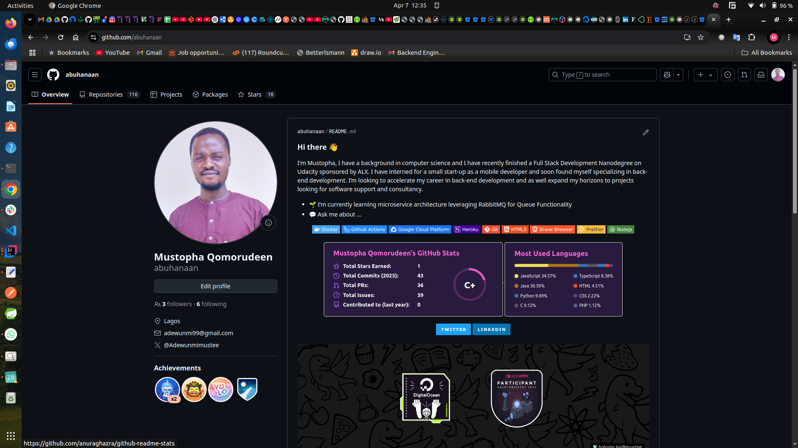
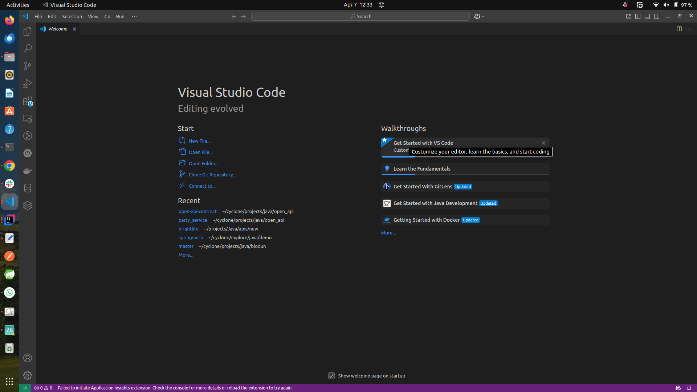
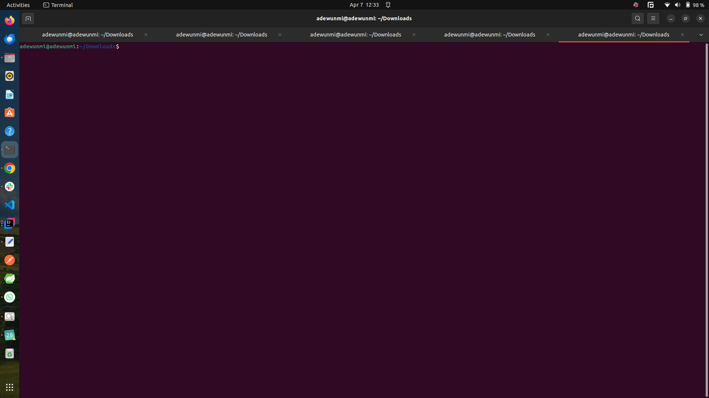
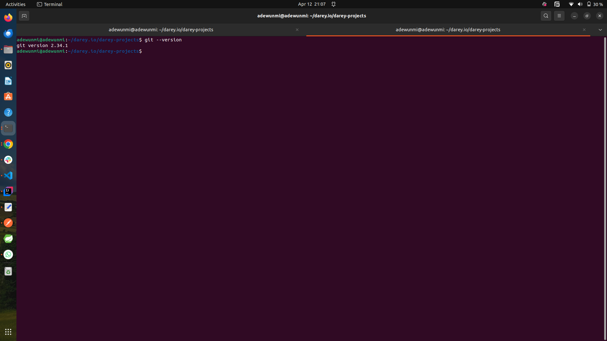

# First Mini Project on Darey.io For Devops Learning Track

This mini project is targeted at setting up the right tools essential for succeeding in this track:

- Github setup
  

- AWS setup
  

- IDE - Visual Studio Code
  

- Ubuntu Setup
  

- Git Setup

