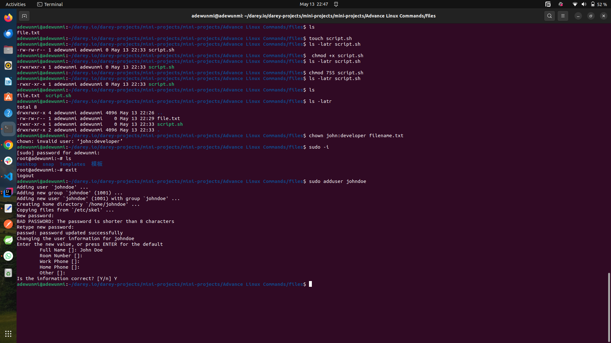
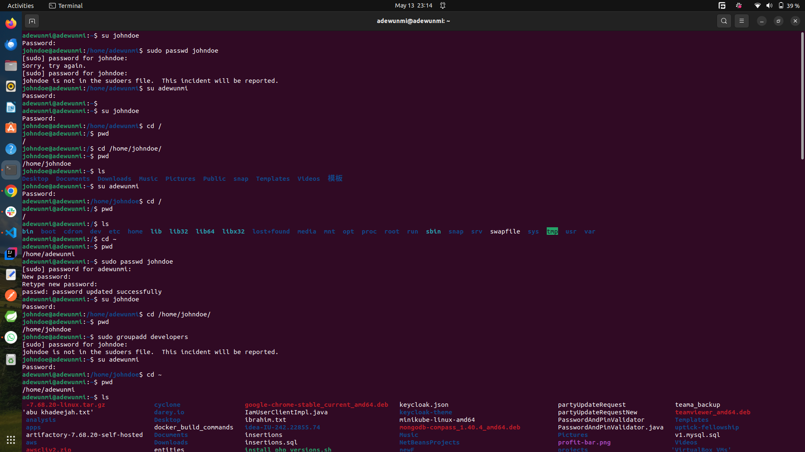

# Advance Linux Commands

In Unix-like operating systems (such as Linux), every file and directory has permissions that control who can read, write, or execute them. These permissions ensure the security and integrity of the system by restricting access based on user roles.


## File Permissions And Access Rights

File permissions can be represented using a three-digit octal number, where each digit corresponds to a different class of user:

- Owner (User)
- Group
- Others (Everyone else)

Each permission type is assigned a numeric value:

| Permission | Symbol | Value |
|------------|--------|-------|
| Read       | `r`    | 4     |
| Write      | `w`    | 2     |
| Execute    | `x`    | 1     |

You add the values together to determine the permissions for each user class.

```bash
chmod 755 filename
```

### Breakdown:

- 7 (4+2+1) → rwx → Owner can read, write, and execute
- 5 (4+0+1) → r-x → Group can read and execute
- 5 (4+0+1) → r-x → Others can read and execute

### Other common values:

- 644: Owner can read/write, others can read.
- 700: Owner has full access; no one else has any access.
- 600: Private files (read/write by owner only).
- 777: Everyone can read/write/execute (security risk).

Permissions can also be represented using symbolic notation with the chmod command. This format is easier to understand for many and is composed of:

### User classes:

- u = user (owner)
- g = group
- o = others
- a = all (user + group + others)

### Operators:

- `+` → add permission
- `-` → remove permission
- `=` → set exact permission

### Permission types:

- r = read
- w = write
- x = execute

### Examples

```bash
chmod u+x script.sh      # Add execute permission for user
chmod go-w file.txt      # Remove write permission from group and others
chmod a=r file.txt       # Set read-only permission for everyone
chmod ug+x myapp         # Add execute permission to user and group
```

Both numeric and symbolic modes are valid and useful. Numeric is more compact, while symbolic is more descriptive.

Sure! Here's a short and clear write-up on `chmod`:

---

### 🔧 `chmod` — Change File Permissions

The `chmod` (change mode) command in Unix/Linux is used to modify the **access permissions** of files and directories.

Permissions define who can **read (r)**, **write (w)**, or **execute (x)** a file or directory. These permissions apply to three categories:

* **User (u)** – the file's owner
* **Group (g)** – users in the file’s group
* **Others (o)** – all other users

---

#### 📌 Usage:

```bash
chmod [options] mode file
```

You can set permissions in:

* **Numeric mode** (e.g., `chmod 755 file.txt`)
* **Symbolic mode** (e.g., `chmod u+x script.sh`)

---

#### ✅ Examples:

```bash
chmod 644 file.txt        # User: rw-, Group: r--, Others: r--
chmod u+x script.sh       # Adds execute permission for user
chmod go-rw secrets.txt   # Removes read and write for group and others
```

---

Use `chmod` carefully to protect sensitive files and maintain system security.


Sure! Here's a short and effective write-up on `chown`:

---

### 👤 `chown` — Change File Owner and Group

The `chown` (change owner) command in Unix/Linux is used to change the **ownership** of files and directories.

Each file has:

* An **owner** (a user)
* A **group** (a group of users)

`chown` allows you to assign a new user and/or group to a file or directory.

---

#### 📌 Usage:

```bash
chown [OPTIONS] user[:group] file
```

* `user` — new owner of the file
* `group` — (optional) new group

---

#### ✅ Examples:

```bash
chown john file.txt         # Change owner to 'john'
chown john:staff file.txt   # Change owner to 'john' and group to 'staff'
chown :developers file.txt  # Change group only
```

Use with `-R` to apply changes **recursively**:

```bash
chown -R john:staff /mydir
```

---

Sure! Here's a **concise write-up on User Management** suitable for documentation, training guides, or quick reference:

---

## 👤 User Management in Linux

User management involves creating, modifying, and deleting user accounts and managing their permissions and group memberships.

### 🔧 Common User Management Commands

| Task                  | Command                                   |
| --------------------- | ----------------------------------------- |
| **Add new user**      | `sudo adduser username`                   |
| **Delete user**       | `sudo deluser username`                   |
| **Change password**   | `sudo passwd username`                    |
| **Modify user**       | `sudo usermod [options] username`         |
| **Create group**      | `sudo addgroup groupname`                 |
| **Add user to group** | `sudo usermod -aG groupname username`     |
| **View user info**    | `id username` or `getent passwd username` |

### 📁 User-Related Files

* `/etc/passwd` – User account info
* `/etc/shadow` – Encrypted user passwords
* `/etc/group` – Group info
* `/etc/sudoers` – Sudo privileges

### 🔐 User Roles

* **Root**: Superuser with full privileges.
* **Regular Users**: Standard accounts with limited permissions.
* **System Users**: Used by services and daemons.

### ✅ Best Practices

* Use strong passwords.
* Grant `sudo` access only when necessary.
* Regularly audit inactive or unnecessary accounts.
* Use groups to manage permissions efficiently.

---


### Handson Practices:

The screenshots below shows practices running the advance linux commands

- File Permissions


- User Management


- Group Management


