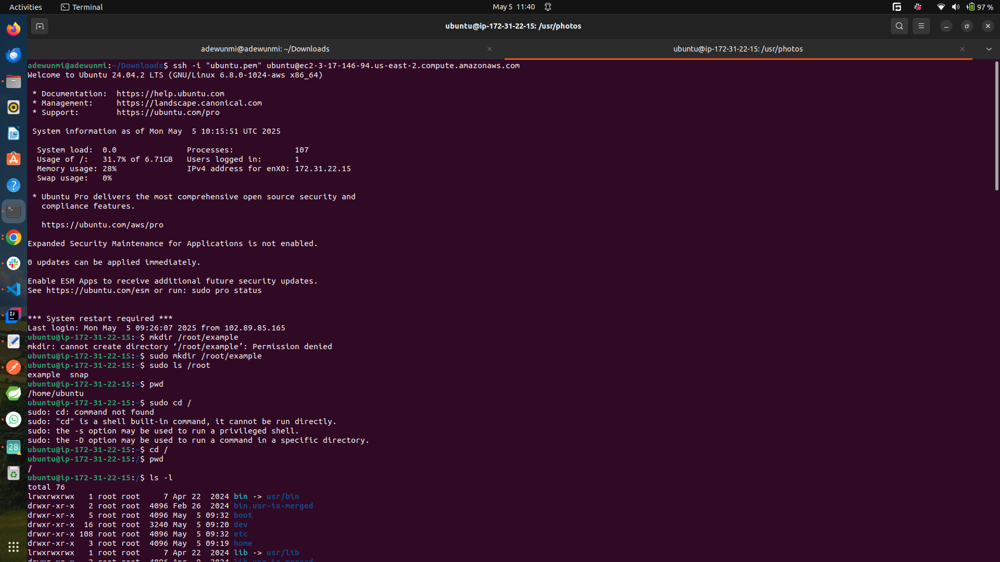
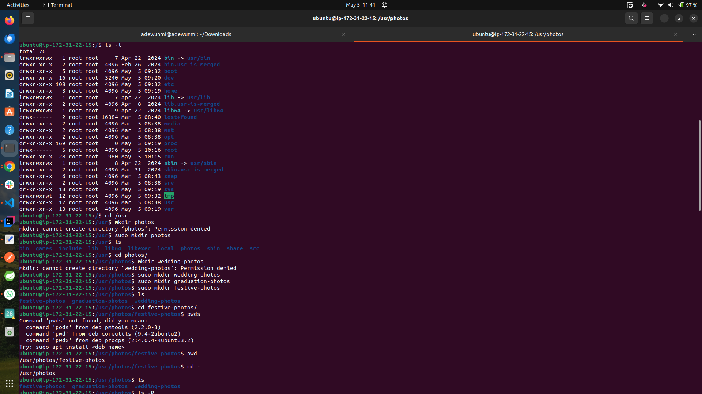
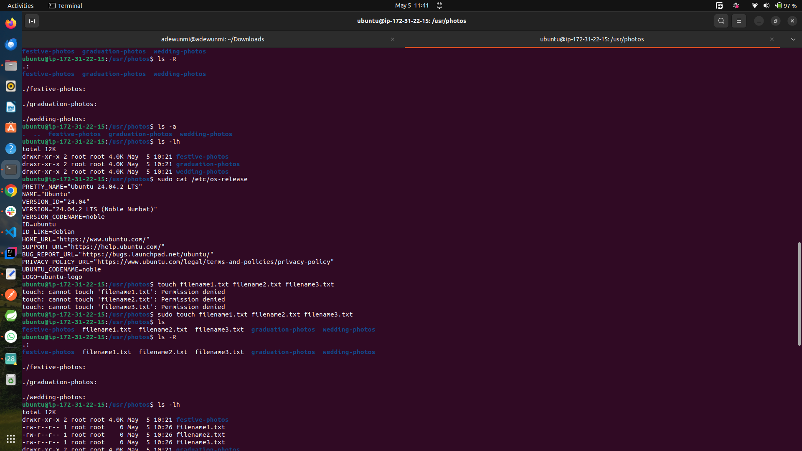
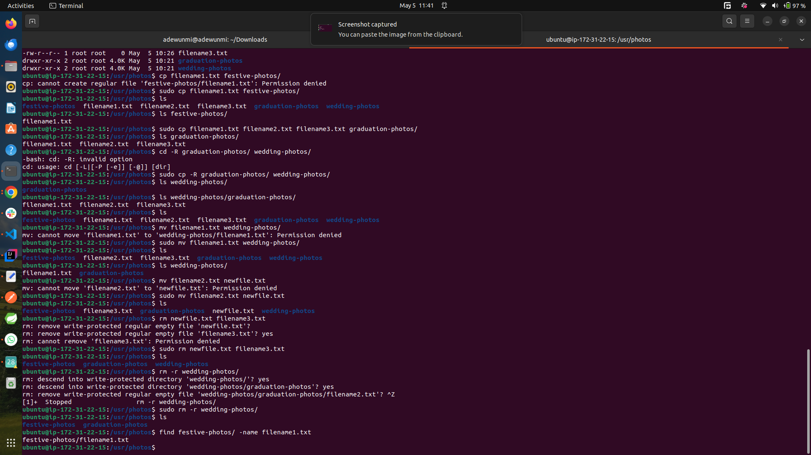

# Linux Commands

Linux command refers to a program or utility that runs in the comman line interface CLI. The CLi is a text based environment where you interact with the ssytem by typing commands.

Linux command can be executed by typing in commands to the CLI and simply pressing enter. These commands are used to execute a wide range of tasks including installing packages, managing users, managing file and directories, configuring system settings and lots.

The general syntax of linux command is as follows:

```bash
CommandName [option(s)] [parameter(s)]
```

- CommandName represents the action to be performed with the command
- option or flag is used to customize how the command is performed. It is usally used with a hyphen(-) or double hypehen(--)
- parameter or argument provides specific information or data required by the command to execute the desired action.

The screenshots below shows some handson experiences while using linux commands like `ls`, `mkdir`, `cd`, `pwd`, `touch`, `find`, `cat`, `cp` ...

- 
- 
- 
- 