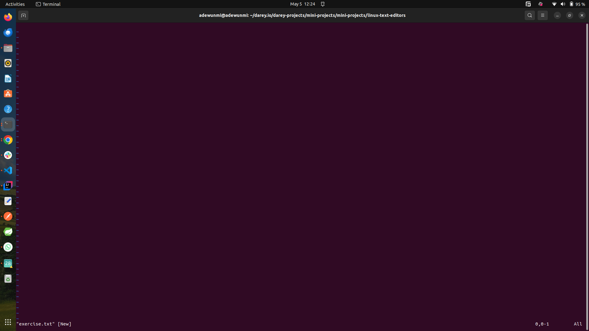
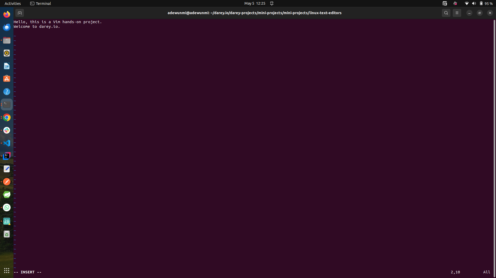
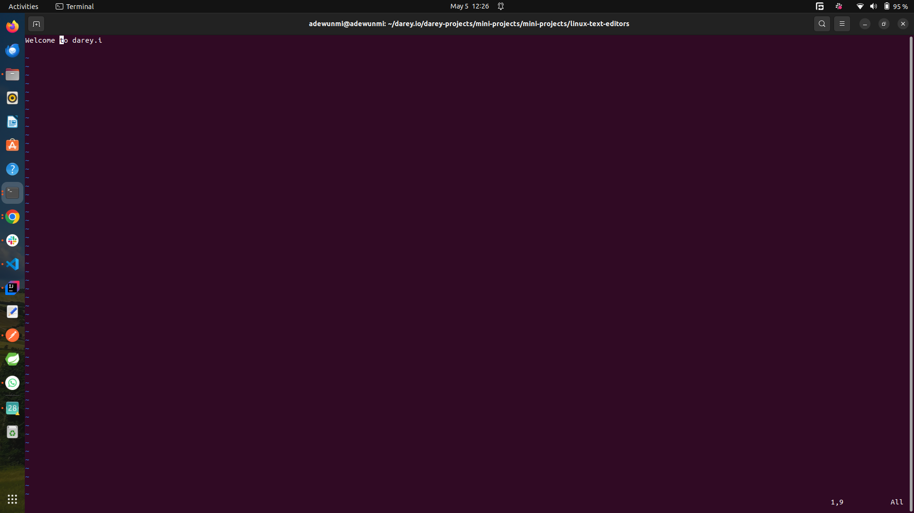
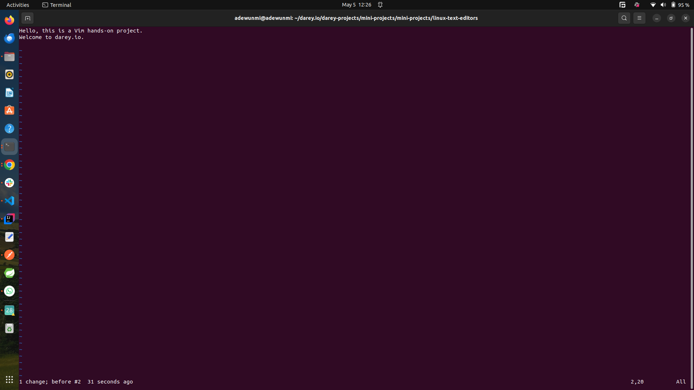
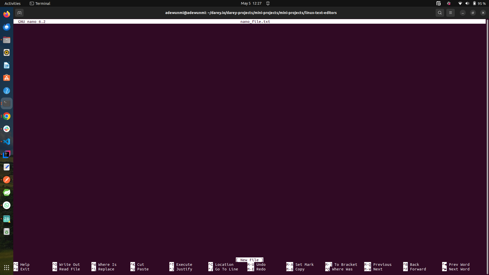
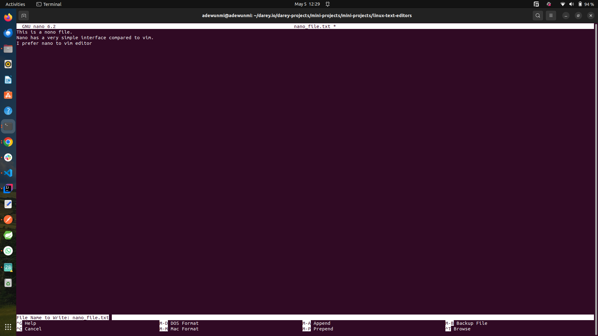
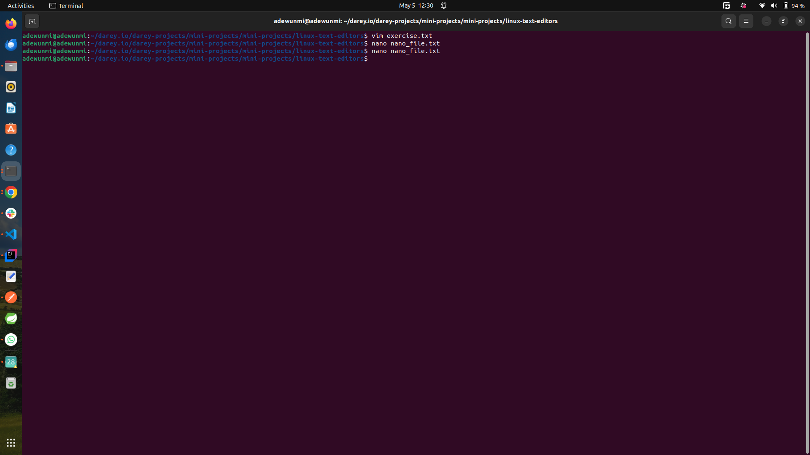

# Linux Text Editors

Linux text editors are programs or text editing tools that operate entirely within a terminal or shell environment. They allow users to create and modify text files directly from the command line without a graphical interface. Examples are vi/vim, nano, emacs etc... 

- vim/vi – Powerful modal editor, steep learning curve, highly configurable.

- nano – User-friendly, straightforward, great for quick edits.

The screenshots below shows some handson practices working with vim and nano

## Entering the vim interface

- 

## Entering vims insert mode and typing 

- characters are inserted using command `i`
- exit insert mode with command `q`

## deleting characters and lines

- delete single character with command `x`
- delete a whole line by pressing `d` twice

## Undo operation

- undo previous operation by pressing command `u`

## Saving and exiting vim editor

Save and with the command `:wq`

## Nano editor interface

- 

## Saving and exiting

- Save changes with command `ctrl` + `o` which brings a promp asking one to confirm the name of the file, pressing `enter` key saves the file and exit the editor.

## Opening an existing file with nano command

- 