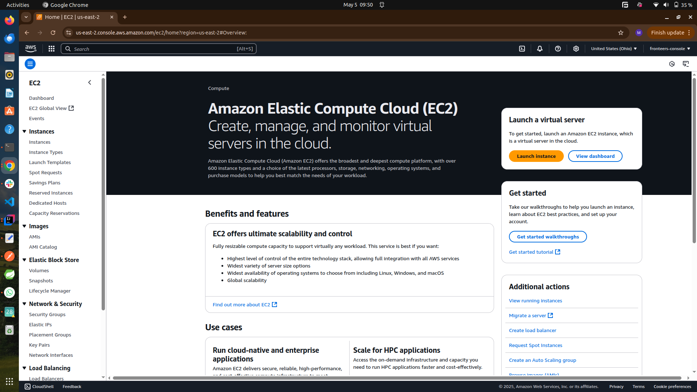

# Introduction To Linux

This documentation displays handson mini project on introcution to linux at darey.io showing screen shots of actions on aws console while creating an EC2 instance, connecting to the instance from local terminal via ssh and afterwards installing and un-installing application on the instance remotely.

## Screeshots

### AWS Console

### Creating key pair file

### Preview of the EC2 instance before creation

### Overview of the EC2 instance after cretion

### EC2 instance connection steps

### Connecting to the EC2 via ssh

### Refreshing Existing Package List

### Existing Package List Refresh Completed

### Installing and using the `tree` command

### Updating Existing Package List

### Existing Package List Update Completed

### Uninstalling the tree program from the instance

