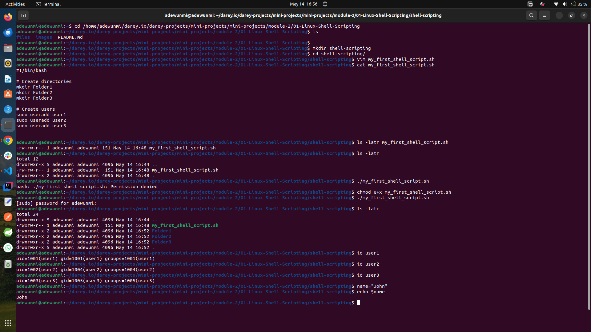

# 🐚 Linux Shell Scripting

## 📘 What is Shell Scripting?

Shell scripting is writing a series of command-line instructions in a text file (script) to automate tasks in Unix/Linux environments. The **Bash** shell is the most commonly used.

---

### 📄 Basic Script Structure

```bash
#!/bin/bash
# This is a comment
echo "Hello, World!"
```

* `#!/bin/bash`: Shebang line that tells the system to use Bash to execute the script.
* `echo`: Prints output to the terminal.
* Comments start with `#`.

---

### ▶️ Running a Shell Script

Make it executable and run:

```bash
chmod +x script.sh
./script.sh
```

---

### 🔁 Common Features

#### 📥 Variables

```bash
name="Alice"
echo "Hello, $name"
```

#### 📤 User Input

```bash
read -p "Enter your name: " user
echo "Welcome, $user"
```

#### 🔁 Conditionals

```bash
if [ "$age" -ge 18 ]; then
  echo "Adult"
else
  echo "Minor"
fi
```

#### 🔁 Loops

**For loop:**

```bash
for i in 1 2 3; do
  echo "Number: $i"
done
```

**While loop:**

```bash
while [ $count -le 5 ]; do
  echo "Count is $count"
  ((count++))
done
```

---

### 📦 Useful Commands

| Task               | Command                   |
| ------------------ | ------------------------- |
| String comparison  | `==`, `!=`                |
| Numeric comparison | `-eq`, `-lt`, `-gt`, etc. |
| File exists        | `[ -f filename ]`         |
| Directory exists   | `[ -d dirname ]`          |

---

### ✅ Best Practices

* Always start scripts with `#!/bin/bash`.
* Use comments generously.
* Handle user input validation and errors.
* Make scripts executable with `chmod +x`.
* Use functions to organize reusable code.

---

### Handson practice

The screenshot below shows terminal while running linux shell script


