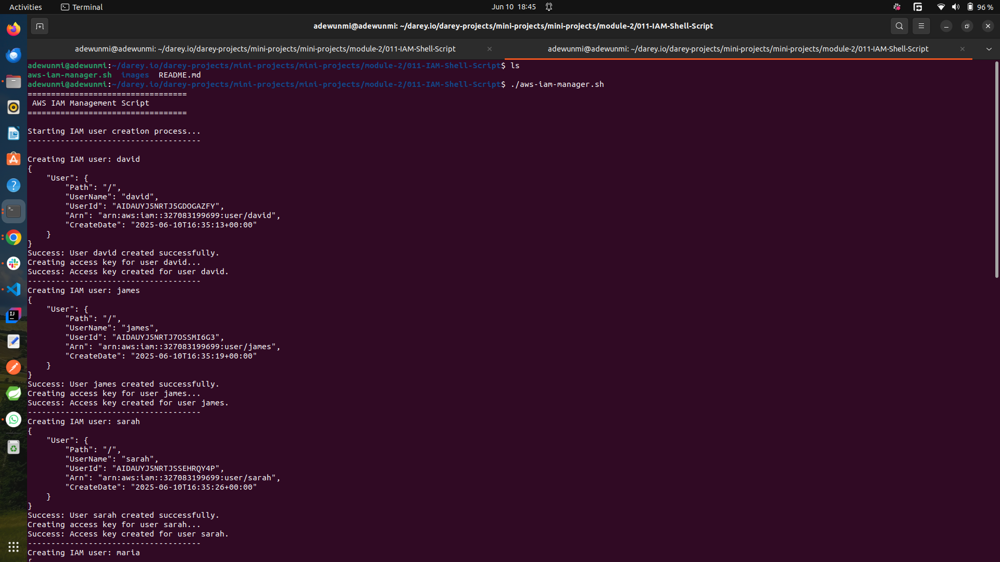
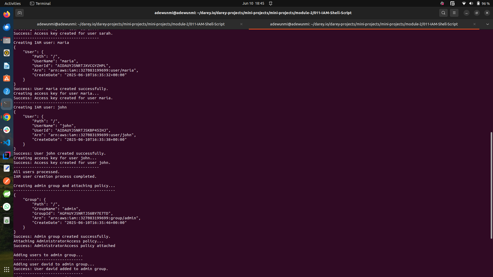
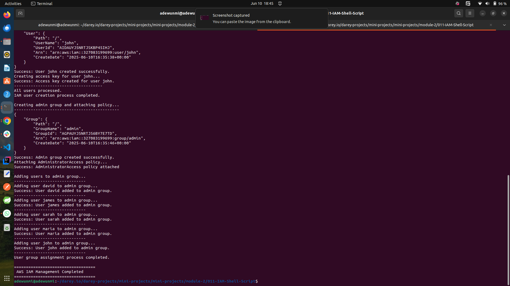
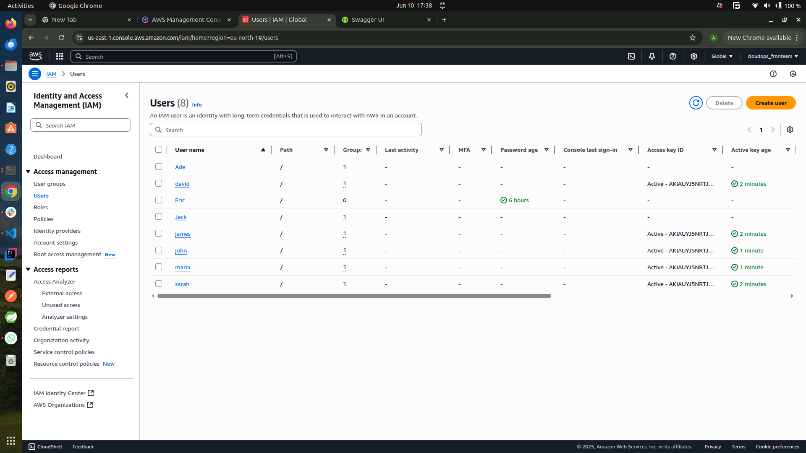
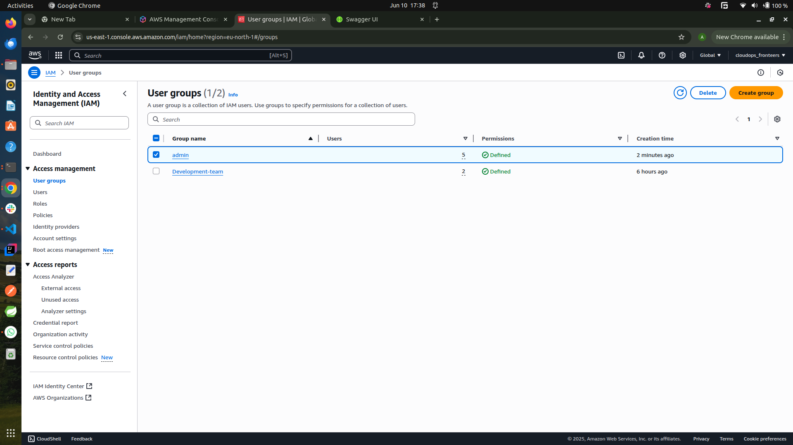
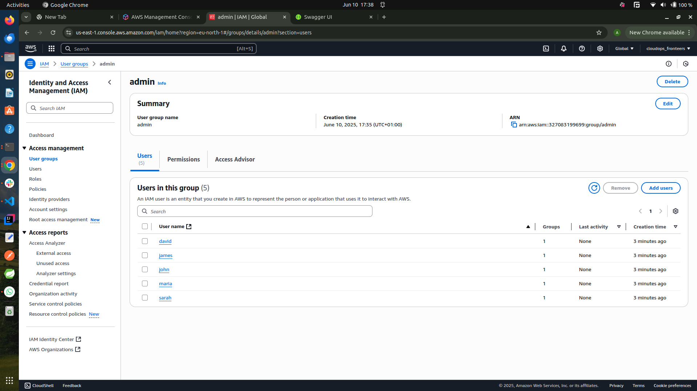
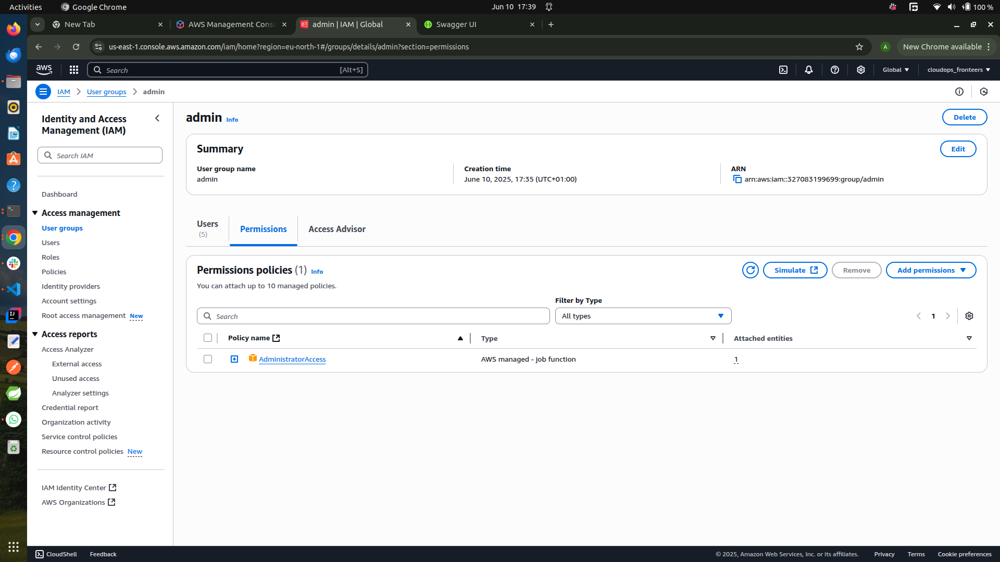

# Shell Script For AWS IAM Management

## Problem Statement

An organisation **CloudOps Solutions** had recently adopted AWS to manage its cloud infrastructures. As the company scales, they have decided to automate the process of managing AWS IAM resources. This includes the creation of users, user groups and the assignment of permissions new hires, especially for their devOps team.

## Objectives

- Define a variable that holds the array of the name of the five IAM users for easy iteration during user creation
- Iterate throught the array and create the IAM users using AWS CLI command
- Define and call a function that creates an IAM group named `admin`
- Attach an AWS managed aministrative policy ("AdministrativeAccess") to the admin group to grant administrative privileges
- Iterate through the array of IAM user names and assign each user to the admin group using AWS CLI command.

## The Bash Script

The bash script that automates the processes above can be accessed [here](./aws-iam-manager.sh)

## Results

The after effect of running the script can be seen on the AWS console as well as the terminal

### Effects of the Script on Terminal

### Effects Of The Script On AWS Management Console

The screenshots shows and confirms:

- the creation of the users and admin group
- the assignment of AWS managed Adminstrative policy to the admin group
- and eventually the addition of the users to the `admin` user group

