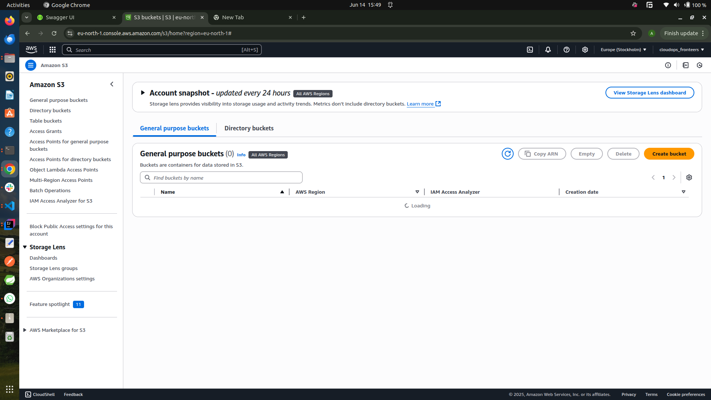
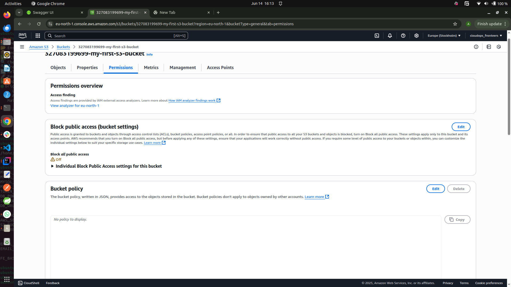
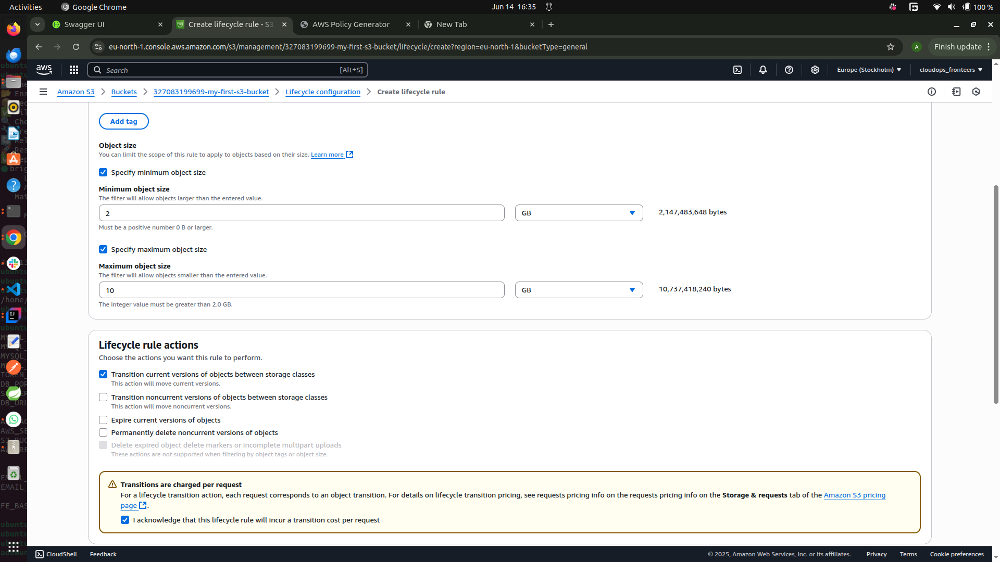

# Amazon S3

## What is Amazon S3?

**Amazon Simple Storage Service (Amazon S3)** is an object storage service offered by AWS that provides industry-leading scalability, data availability, security, and performance. It allows you to store and retrieve any amount of data from anywhere on the web.

## Key Features

- **Scalable Storage:** Store virtually unlimited amounts of data.
- **Durability and Availability:** Designed for 99.999999999% (11 9's) durability and high availability.
- **Security:** Supports encryption, access control policies, and integration with AWS IAM.
- **Flexible Data Management:** Lifecycle policies, versioning, and replication.
- **Easy Integration:** Accessible via AWS Management Console, CLI, SDKs, and REST API.

## Common Use Cases

- Backup and restore
- Data archiving
- Hosting static websites
- Storing application data and media files
- Big data analytics

## Basic Concepts

- **Bucket:** A container for storing objects (files, data).
- **Object:** The actual data stored in S3, along with its metadata.
- **Key:** The unique identifier for an object within a bucket.
- **Region:** The AWS geographical area where your bucket and data reside.

## Example: Creating a Bucket with AWS CLI

```bash
aws s3 mb s3://my-example-bucket
```

## Example: Uploading a File

```bash
aws s3 cp myfile.txt s3://my-example-bucket/
```

Amazon S3 is a foundational AWS service for reliable, secure, and scalable cloud storage.

## S3 Versioning

**S3 Versioning** is a feature in Amazon S3 that allows you to keep multiple versions of an object in a bucket. With versioning enabled, you can preserve, retrieve, and restore every version of every object stored in your bucket. This helps protect against accidental deletions and overwrites.

### Key Benefits

- **Data Protection:** Recover from unintended user actions and application failures.
- **Object Recovery:** Restore previous versions of objects that are deleted or overwritten.
- **Audit and Compliance:** Maintain a history of changes to objects for auditing purposes.

### How to Enable Versioning

You can enable versioning on a bucket using the AWS Management Console, AWS CLI, or SDKs.

#### Using AWS CLI

```bash
aws s3api put-bucket-versioning --bucket my-example-bucket --versioning-configuration Status=Enabled
```

### How Versioning Works

- When versioning is enabled, each object in the bucket receives a unique version ID.
- Uploading a new object with the same key creates a new version, but older versions are still retained.
- Deleting an object adds a "delete marker" but does not remove previous versions.

### Example: Listing Object Versions

```bash
aws s3api list-object-versions --bucket my-example-bucket
```

### Example: Restoring a Previous Version

To restore a previous version, copy it over the current version or remove the delete marker.

### Disabling Versioning

You can suspend versioning, but existing versions remain:

```bash
aws s3api put-bucket-versioning --bucket my-example-bucket --versioning-configuration Status=Suspended
```

---

S3 Versioning is a powerful tool for data protection and recovery in your AWS storage strategy.

## Enabling Versioning On AWS Management Console

This section contains screenshots showing processes in enabling versioning in AWS S3

### Creating S3 bucket




### Creating a file locally and uploading it to s3

- The screenshot below shows the content of the file before uploading it to s3


- The screenshots below show the upload process


### Enabling Versioning on The Bucket

- To enable versioning on the bucket, click on the **Permission** tab and click on the **edit** button on the **Bucket Versioning** section, click on **Enable** then save


- modify the file locally and upload again
- the screenshot below shows the content of the file after modification


- To view the object versions, toggle the **show versions** button on the top of the object list page


### Viewing the contents of both versions of the file

- the first step involves enabling public access to the file, that can be achieved on the **Permission** tab of the bucket




- Now that the objects of the bucket can be publicly accessed, there is need to set up policy that specifies actions the public can perform on objects of the bucket. This can be achieved by clicking on the **Edit** button on the **Bucket Policy** section, then the AWS **Policy Generator** can be leveraged on to create the policy:


- Copy the policy from the generator and paste it on the bucket policy then save


- To view the content of the first version, click on the first version and click on its url


- Do the same for the second version


## Lifecycle Policy

An **S3 Lifecycle Policy** is a set of rules that automate the transition and expiration of objects in your S3 buckets. Lifecycle policies help you manage your storage costs and data retention by automatically moving objects to different storage classes or deleting them after a specified period.

### Key Benefits of Lifecycle Policy

- **Cost Optimization:** Automatically transition objects to lower-cost storage classes (e.g., S3 Standard-IA, S3 Glacier) as they age.
- **Automated Data Management:** Set up rules to delete old versions or expired objects, reducing manual intervention.
- **Compliance:** Enforce data retention policies for regulatory or business requirements.

### How to Create a Lifecycle Policy

You can create lifecycle policies using the AWS Management Console, AWS CLI, or SDKs.

#### Using AWS Management Console

1. Go to your S3 bucket and click on the **Management** tab.
2. Click **Create lifecycle rule**.
3. Enter a rule name and define the scope (e.g., apply to all objects or a prefix).
4. Add transitions (e.g., move to S3 Glacier after 30 days).
5. Add expiration actions (e.g., delete objects after 365 days).
6. Review and save the rule.

#### Using AWS CLI to create Lifecycle Policy

```bash
aws s3api put-bucket-lifecycle-configuration --bucket my-example-bucket --lifecycle-configuration '{
  "Rules": [
    {
      "ID": "MoveToGlacierAndExpire",
      "Prefix": "",
      "Status": "Enabled",
      "Transitions": [
        {
          "Days": 30,
          "StorageClass": "GLACIER"
        }
      ],
      "Expiration": {
        "Days": 365
      }
    }
  ]
}'
```

### Example Use Cases

- Move logs to S3 Glacier after 30 days and delete after 1 year.
- Automatically delete incomplete multipart uploads after 7 days.
- Expire previous versions of objects to save storage costs.

---

Lifecycle policies are essential for efficient, automated, and cost-effective management of your S3 data.

### Creating Lifecycle Policies On AWS Management Console

Click on the **Management** tab and click on **create-lifecycle** button





## S3 Storage Classes

Amazon S3 offers a range of **storage classes** designed to help you optimize costs based on how frequently and quickly you need to access your data. Each storage class is built for a different use case and provides varying levels of durability, availability, and cost.

### Common S3 Storage Classes

- **S3 Standard:**  
  General-purpose storage for frequently accessed data. Offers high durability, availability, and performance.

- **S3 Intelligent-Tiering:**  
  Automatically moves data between two access tiers (frequent and infrequent) when access patterns change, optimizing costs without performance impact.

- **S3 Standard-IA (Infrequent Access):**  
  For data that is accessed less frequently but requires rapid access when needed. Lower storage cost, but higher retrieval cost.

- **S3 One Zone-IA:**  
  For infrequently accessed data that does not require multiple Availability Zone resilience. Lower cost than Standard-IA.

- **S3 Glacier:**  
  Low-cost storage for data archiving and long-term backup. Retrieval times range from minutes to hours.

- **S3 Glacier Deep Archive:**  
  Lowest-cost storage class for long-term retention of data that is rarely accessed. Retrieval time is typically within 12 hours.

### Choosing a Storage Class

- Use **S3 Standard** for active data and applications.
- Use **S3 Intelligent-Tiering** if your access patterns are unpredictable.
- Use **S3 Standard-IA** or **One Zone-IA** for backups and disaster recovery.
- Use **S3 Glacier** or **Glacier Deep Archive** for compliance archives and digital preservation.

### Example: Specifying Storage Class When Uploading

```bash
aws s3 cp myfile.txt s3://my-example-bucket/ --storage-class STANDARD_IA
```

---

Selecting the right storage class helps you balance cost, performance, and data durability for your specific needs.
