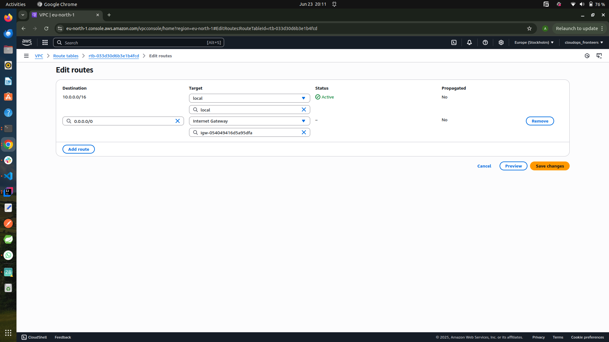
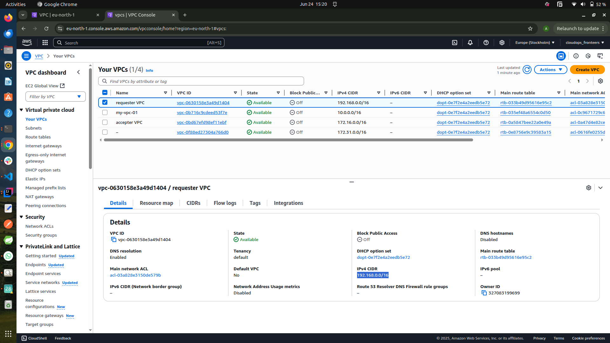

# AWS VPC

## What is AWS VPC?

**Amazon Virtual Private Cloud (VPC)** is a service that lets you launch AWS resources into a virtual network that you define. This virtual network closely resembles a traditional network that you might operate in your own data center, with the benefits of using the scalable infrastructure of AWS.

## Key Features

- **Customizable Network:** Define your own IP address range, create subnets, and configure route tables and network gateways.
- **Security:** Use security groups and network ACLs to control inbound and outbound traffic to resources in your VPC.
- **Isolation:** Each VPC is logically isolated from other virtual networks in the AWS Cloud.
- **Connectivity:** Connect your VPC to the internet, your corporate data center, or other VPCs using VPN, Direct Connect, or VPC peering.

## Basic Components

- **Subnet:** A range of IP addresses in your VPC. You can launch AWS resources into a specified subnet.
- **Route Table:** Controls the routing for the subnets within your VPC.
- **Internet Gateway:** Allows communication between your VPC and the internet.
- **NAT Gateway:** Enables instances in a private subnet to connect to the internet or other AWS services, but prevents the internet from initiating a connection with those instances.
- **Security Group:** Acts as a virtual firewall for your instances to control inbound and outbound traffic.
- **Network ACL:** An optional layer of security for your VPC that acts as a firewall for controlling traffic in and out of one or more subnets.

## Common Use Cases

- Hosting web applications in a secure and scalable environment.
- Creating isolated environments for development, testing, or production.
- Connecting on-premises networks to AWS using VPN or Direct Connect.

## Example: Creating a VPC with AWS CLI

```bash
aws ec2 create-vpc --cidr-block 10.0.0.0/16
```

---

AWS VPC gives you full control over your virtual networking environment, enabling you to build secure and scalable cloud architectures.

## Subnets

A **subnet** (short for "subnetwork") is a range of IP addresses within your VPC. Subnets allow you to segment your VPC into smaller networks to organize and secure your AWS resources.

### Key Points

- **Public Subnet:** A subnet that is associated with a route table containing a route to an internet gateway. Resources in a public subnet can communicate directly with the internet.
- **Private Subnet:** A subnet that does not have a route to an internet gateway. Resources in a private subnet cannot communicate directly with the internet.
- **Subnet CIDR Block:** Each subnet must be assigned a subset of the VPC’s CIDR block. For example, if your VPC uses `10.0.0.0/16`, you might create a subnet with `10.0.1.0/24`.
- **Availability Zones:** Subnets are created in a specific Availability Zone within a region. This helps you design highly available and fault-tolerant architectures.

### Example: Creating a Subnet with AWS CLI

```bash
aws ec2 create-subnet --vpc-id vpc-12345678 --cidr-block 10.0.1.0/24 --availability-zone us-east-1a
```

### Best Practices

- Use multiple subnets across different Availability Zones for high availability.
- Place public-facing resources (like web servers) in public subnets and backend resources (like databases) in private subnets.
- Use Network ACLs and security groups to control traffic at the subnet and instance level.

Subnets are fundamental building blocks for organizing and securing your AWS VPC resources.

## Internet Gateway and NAT Gateway

### Internet Gateway

An **Internet Gateway** is a horizontally scaled, redundant, and highly available VPC component that allows communication between resources in your VPC and the internet. It enables instances in your public subnets to connect to the internet and receive connections from the internet.

#### Key Points on Internet Gateway

- Must be attached to your VPC.
- Route tables must have a route to the internet gateway for internet access.
- Required for public subnets.

#### Example: Creating and Attaching an Internet Gateway with AWS CLI

```bash
aws ec2 create-internet-gateway
aws ec2 attach-internet-gateway --internet-gateway-id igw-12345678 --vpc-id vpc-12345678
```

---

### NAT Gateway

A **NAT Gateway** (Network Address Translation Gateway) enables instances in a private subnet to connect to the internet or other AWS services, but prevents the internet from initiating a connection with those instances. This is useful for scenarios where you want your backend servers to download updates or access external resources without being directly exposed to the internet.

#### Key Points On NAT Gateway

- Deployed in a public subnet.
- Requires an Elastic IP address.
- Route tables for private subnets must direct internet-bound traffic to the NAT gateway.
- Only supports outbound connections from private subnets.

#### Example: Creating a NAT Gateway with AWS CLI

```bash
aws ec2 allocate-address
aws ec2 create-nat-gateway --subnet-id subnet-12345678 --allocation-id eipalloc-12345678
```

---

**Summary:**  

- Use an **Internet Gateway** for direct internet access from public subnets.
- Use a **NAT Gateway** to allow private subnet resources to access the internet securely, without exposing them to inbound internet traffic.

## How VPC, Subnet, Internet Gateway, and NAT Gateway Work Together

When you build a network in AWS, these components work together to provide secure and flexible connectivity for your resources:

### 1. VPC (Virtual Private Cloud)

A **VPC** is your own isolated network within AWS. You define its IP address range (CIDR block) and control how resources communicate inside and outside the VPC.

### 2. Subnets

Within your VPC, you create **subnets** to segment your network. Typically, you’ll have:

- **Public Subnets:** For resources that need direct access to the internet (like web servers).
- **Private Subnets:** For resources that should not be directly accessible from the internet (like databases or application servers).

Each subnet resides in a specific Availability Zone for high availability and fault tolerance.

### 3. Internet Gateway

An **Internet Gateway** is attached to your VPC to enable communication between resources in public subnets and the internet. You update the route table for your public subnet to direct internet-bound traffic to the internet gateway.

- **Public Subnet Example:**  
  A web server in a public subnet can receive requests from users on the internet because its route table points to the internet gateway.

### 4. NAT Gateway

A **NAT Gateway** is placed in a public subnet and allows resources in private subnets to initiate outbound connections to the internet (for software updates, API calls, etc.), but prevents inbound connections from the internet.

- **Private Subnet Example:**  
  A database server in a private subnet cannot be accessed directly from the internet. However, it can download updates or access external services via the NAT gateway. The private subnet’s route table sends internet-bound traffic to the NAT gateway in the public subnet.

---

### How They Connect

1. **Create a VPC** with a CIDR block (e.g., `10.0.0.0/16`).
2. **Create subnets** within the VPC:
   - Public subnet (e.g., `10.0.1.0/24`)
   - Private subnet (e.g., `10.0.2.0/24`)
3. **Attach an Internet Gateway** to the VPC.
4. **Update the public subnet’s route table** to send internet traffic (`0.0.0.0/0`) to the internet gateway.
5. **Create a NAT Gateway** in the public subnet and associate it with an Elastic IP.
6. **Update the private subnet’s route table** to send internet traffic (`0.0.0.0/0`) to the NAT gateway.

---

### Visual Summary

```
Internet
   |
[Internet Gateway]
   |
[Public Subnet] ---- [NAT Gateway] ---- [Private Subnet]
   |                      |                   |
[Web Server]         [Elastic IP]         [Database Server]
```

- **Public Subnet:** Direct access to/from the internet via the Internet Gateway.
- **Private Subnet:** Outbound internet access via the NAT Gateway, no direct inbound internet access.

---

By combining these components, you can build secure, scalable, and highly available network architectures in AWS, controlling exactly how your resources communicate with each other and with the outside

## IP Addresses in AWS VPC

An **IP address** is a unique identifier assigned to each device or resource on a network. In AWS VPC, IP addresses are used to enable communication between resources within your VPC and with external networks.

### Types of IP Addresses

- **Private IP Address:**  
  Assigned to resources within your VPC (such as EC2 instances) for internal communication. Private IPs are not routable over the internet.

- **Public IP Address:**  
  Assigned to resources in a public subnet to enable direct communication with the internet. Public IPs are routable over the internet.

- **Elastic IP Address:**  
  A static, public IPv4 address that you can allocate to your AWS account and associate with resources such as EC2 instances or NAT gateways. Elastic IPs remain the same even if you stop and start your instance.

### How IP Addresses Work in a VPC

- When you launch an instance in a subnet, AWS automatically assigns it a private IP address from the subnet’s CIDR block.
- If the subnet is public and you enable auto-assign public IP, the instance also gets a public IP address.
- You can associate an Elastic IP with an instance or NAT gateway for a persistent public address.

### Example

- **VPC CIDR Block:** `10.0.0.0/16`
- **Public Subnet:** `10.0.1.0/24` (instances here can have both private and public IPs)
- **Private Subnet:** `10.0.2.0/24` (instances here have only private IPs)

### IP Best Practices

- Use private IP addresses for internal communication between resources.
- Use public or Elastic IP addresses only when necessary for internet-facing resources.
- Plan your VPC and subnet CIDR blocks to avoid IP address conflicts.

Understanding IP address management is essential for designing secure and efficient

## CIDR (Classless Inter-Domain Routing)

**CIDR** stands for Classless Inter-Domain Routing. It is a method for allocating IP addresses and routing IP packets. In AWS VPC, CIDR blocks are used to define the range of IP addresses available for your VPC and its subnets.

### CIDR Key Points

- **CIDR Notation:**  
  CIDR uses the format `IP_address/Prefix_Length`.  
  For example: `10.0.0.0/16`
  - `10.0.0.0` is the starting IP address.
  - `/16` indicates that the first 16 bits are the network portion, leaving the remaining bits for host addresses.

- **VPC CIDR Block:**  
  When you create a VPC, you specify a CIDR block (e.g., `10.0.0.0/16`). This defines the total pool of private IP addresses available in your VPC.

- **Subnet CIDR Block:**  
  Each subnet within the VPC is assigned a subset of the VPC’s CIDR block (e.g., `10.0.1.0/24`).

### CIDR Example

- **VPC CIDR:** `10.0.0.0/16` (provides 65,536 IP addresses)
- **Subnet CIDR:** `10.0.1.0/24` (provides 256 IP addresses)

### Why CIDR is Important

- **Flexible IP Allocation:** Allows you to divide your network into subnets of different sizes.
- **Efficient Use of IP Space:** Reduces waste compared to traditional class-based IP addressing.
- **Network Segmentation:** Helps you organize and secure your AWS resources.

### CIDR Best Practices

- Plan your CIDR blocks to avoid overlap with other networks you might connect to (such as on-premises networks).
- Use larger CIDR blocks for your VPC to allow for future growth.
- Assign smaller CIDR blocks to subnets based on your needs.

CIDR is fundamental to designing scalable and efficient network

## Gateway

A **gateway** in networking is a device or service that acts as an entry and exit point between two different networks, enabling communication between them. In AWS, gateways are essential components for connecting your VPC to other networks or the internet.

### Types of Gateways in AWS

- **Internet Gateway:**  
  Allows communication between resources in your VPC and the internet. It is required for public subnets to send and receive traffic from the internet.

- **NAT Gateway:**  
  Enables instances in a private subnet to initiate outbound connections to the internet while preventing inbound connections from the internet.

- **Virtual Private Gateway:**  
  Used to connect your VPC to a remote network, such as your on-premises data center, via a VPN connection.

- **Transit Gateway:**  
  A scalable service that connects multiple VPCs and on-premises networks through a central hub, simplifying network architecture.

### Why Gateways Matter

- **Connectivity:** Gateways enable your AWS resources to communicate with external networks, the internet, or other VPCs.
- **Security:** By controlling which subnets use which gateways, you can manage and secure traffic flow in and out of your VPC.
- **Scalability:** Gateways like Transit Gateway make it easier to manage complex, multi-VPC environments.

Gateways are fundamental building blocks for designing secure and connected cloud network architectures

## Route Table

A **route table** in AWS VPC is a set of rules, called routes, that determine how network traffic is directed within your VPC. Each subnet in your VPC must be associated with a route table, which controls the flow of traffic to and from the subnet.

### Route TableKey Points

- **Routes:** Each route specifies a destination CIDR block and a target (such as an internet gateway, NAT gateway, or another subnet).
- **Main Route Table:** Every VPC has a main route table by default, which is automatically associated with all subnets unless you explicitly associate a subnet with a different route table.
- **Custom Route Tables:** You can create additional route tables and associate them with specific subnets for more granular control.

### Example: Public and Private Subnets

- **Public Subnet Route Table:**  
  Contains a route that directs internet-bound traffic (`0.0.0.0/0`) to the internet gateway.

- **Private Subnet Route Table:**  
  Contains a route that directs internet-bound traffic to a NAT gateway, but not directly to the internet gateway.

### Example: Adding a Route with AWS CLI

```bash
aws ec2 create-route --route-table-id rtb-12345678 --destination-cidr-block 0.0.0.0/0 --gateway-id igw-12345678
```

### Route Table Best Practices

- Use separate route tables for public and private subnets to control access.
- Regularly review your route tables to ensure they align with your security and connectivity requirements.
- Document your route table configurations for easier troubleshooting and maintenance.

Route tables are essential for managing network traffic and ensuring your AWS resources can communicate as intended.

## Connection Between Gateway and Route Table

In AWS VPC, **gateways** (such as Internet Gateway, NAT Gateway, or Virtual Private Gateway) work together with **route tables** to control how traffic flows in and out of your subnets.

### How They Work Together

- **Route Table as the Traffic Director:**  
  A route table contains rules (routes) that determine where network traffic is directed based on its destination IP address.

- **Gateway as the Exit/Entry Point:**  
  A gateway acts as the actual device or service that sends traffic outside the VPC (to the internet, another VPC, or on-premises network) or receives incoming traffic.

### Example: Internet Access

1. **Internet Gateway:**  
   Attached to your VPC to enable internet connectivity.

2. **Route Table Entry:**  
   You add a route in the route table for your public subnet:
   - Destination: `0.0.0.0/0` (all traffic)
   - Target: The Internet Gateway (e.g., `igw-12345678`)

   This tells AWS to send all outbound traffic from the subnet to the internet via the Internet Gateway.

### Example: Private Subnet with NAT Gateway

- The route table for a private subnet might have a route:
  - Destination: `0.0.0.0/0`
  - Target: NAT Gateway (e.g., `nat-12345678`)

  This allows instances in the private subnet to access the internet for updates, but prevents inbound connections from the internet.

### Summary

- **Route tables** define *where* traffic should go.
- **Gateways** provide the *means* for traffic to enter or leave the VPC.
- By associating gateways with route tables, you control the connectivity and security of your AWS network.

Understanding this connection is key to designing secure and functional AWS network architectures.

---

## Hands-on Practical

### Steps

- Setting up a Virtual Private Cloud (VPC)
- Configuring Subnets within the VPC
- Creating Internet Gateway And Attaching It to the VPC
- Enabling Intenet Connectivity With The Internet Gateway By Setting Up Routing Tables
- Enabling Outbound Internet Access through NAT Gateway
- Establishing VPC Peering Connections

### Part 1: Setting up a Virtual Private Cloud (VPC)

The following screenshots shows step-by-step process for VPC creation


### Part 2: Configuring Subnets within the VPC

- click on **subnet** on the left side bar and click on **create subnet** button

- select a name: `my-public-subnet`
- select the id of the VPC that was created in part 1, selct an AZ zone and indicate the CIDR block then click on create subnet
- Repeat the same process to create a public subnet


### Part 3: Creating Internet Gateway And Attaching It to the VPC

- Select **Internet Gateway** option at the left side bar and click on **create internet gateway** button at the top right hand side
- Specify a name for the gateway and click on **create internet gateway** button


- Notice that the internet gateway is currently detached as seen in the image below because it is not yet attached to any VPC. Clixk on the action button and and select **Attach To VPC**, select the created VPC in part 1 above and click on **Attach Internet Gateway**


- Notice that the state of the gateway is now **Attached**


___

### Part 4: Enabling Intenet Connectivity With The Internet Gateway By Setting Up Routing Tables

In this part we would be enabling internet connectivity with the internet gateway by setting up routing tables

- Select **Route Tables** at the left side bar and click on **Create route table** button at the top hand right side.
- Enter the name of the route table and select the VPC that was previously created
- Finally, click on **create route table** button to proceed


- Next click on **Subnet Association** tab then click on **Edit Subnet** button

- choose the public subnet and click on **save association**

- Go back to the **Routes** tab and click on **edit route**

- Click on **Add Route**

- Select destination as `0.0.0.0/0` indicating that every IPv4 address can access this subnet
- In the target field, select **Intenet Gateway** and select the internet gateway that was previously created and click on save


The route table has now been configured to route traffic to the internet gateway, allowing connectivity to the internet. Since only the subnet named **my-public-subnet-1** is associated with this route table, only resources within that subnet can access the internet.


The next part is to enable Outbount Internet Access throug NAT gateway to the subnet and attach the route table
___

### Part 5: Enabling Outbound Internet Access through NAT Gateway

- Select **NAT Gateway** at the left side bar and click on **create NAT gateway** button
- Specify a name for the NAT gateway
- Select Connectivity type a s **Private** and choose the already created private subnet
- Now click on **create NAT gateway**


- Navigate to the NAT Gateway list and select the just created NAT Gateway, on the **Detail**, locat the subnet id and click on it

- On the subnet page, click on the **Route Table** tab the click on the rouute table id.
- Proceed to the route section and click on the **edit route**, then click on **add route**
- Select destination as `0.0.0.0/0`, in the target field select NAT Gateway and select the previously created NAT Gateway, finally click on **save changes**
<!-- 
 -->


- Navigate back to the **Subnet Association** tab, click on **Edit Subnet association** button

- Choose the private subnet and click on **save association**


Now the subnet has been successfully attached with the route table


___

## Difference Between Internet Gateway and NAT Gateway

| Feature                | Internet Gateway (IGW)                                  | NAT Gateway (NGW)                                      |
|------------------------|--------------------------------------------------------|--------------------------------------------------------|
| Purpose                | Enables resources in a VPC to connect to the internet and receive inbound connections from the internet. | Enables resources in a private subnet to initiate outbound connections to the internet, but prevents inbound connections from the internet. |
| Use Case               | Used for public subnets (e.g., web servers).           | Used for private subnets (e.g., backend servers, databases needing software updates). |
| Direction of Traffic   | Supports both inbound and outbound internet traffic.   | Supports only outbound internet traffic from private subnets. |
| Inbound Connections    | Allowed (if security group and NACL rules permit).     | Not allowed; blocks all unsolicited inbound connections. |
| Outbound Connections   | Allowed.                                               | Allowed (initiated from inside the VPC).               |
| Association            | Attached directly to the VPC.                          | Created in a public subnet and associated with an Elastic IP. |
| Cost                   | No additional cost.                                    | Charged per hour and per GB of data processed.         |

### Summary

- **Internet Gateway** is for direct internet access (inbound and outbound) for public subnets.
- **NAT Gateway** is for secure outbound-only internet access for private subnets, preventing direct inbound connections from


___

## VPC Peering

**VPC Peering** is a networking connection between two Virtual Private Clouds (VPCs) that enables you to route traffic between them using private IP addresses. VPC peering allows resources in different VPCs to communicate as if they are within the same network.

### VPC Peering Key Points

- **Private Communication:** Traffic between peered VPCs stays on the AWS network and does not traverse the public internet.
- **Cross-Account Peering:** You can peer VPCs across different AWS accounts and even across different regions (inter-region peering).
- **No Transitive Peering:** If VPC A is peered with VPC B, and VPC B is peered with VPC C, A cannot communicate with C through B.
- **Security:** You control which resources can communicate across the peering connection using route tables, security groups, and network ACLs.

### VPC Peering Common Use Cases

- Sharing resources (like databases or services) between different VPCs.
- Connecting VPCs in different AWS accounts for collaboration.
- Isolating environments (e.g., development and production) while allowing controlled communication.

### How to Create a VPC Peering Connection (AWS CLI Example)

```bash
# Request a peering connection
aws ec2 create-vpc-peering-connection --vpc-id vpc-11111111 --peer-vpc-id vpc-22222222

# Accept the peering connection (in the peer account or region)
aws ec2 accept-vpc-peering-connection --vpc-peering-connection-id pcx-12345678

# Update route tables in both VPCs to allow traffic to flow between them
aws ec2 create-route --route-table-id rtb-11111111 --destination-cidr-block 10.2.0.0/16 --vpc-peering-connection-id pcx-12345678
aws ec2 create-route --route-table-id rtb-22222222 --destination-cidr-block 10.1.0.0/16 --vpc-peering-connection-id pcx-12345678
```

### VPC Peeriing Best Practices

- Only allow necessary traffic between VPCs by updating security groups and route tables.
- Avoid overlapping CIDR blocks between peered VPCs.
- Regularly review peering connections and permissions for security.

VPC peering is a powerful way to enable private, secure communication between VPCs

### Part 6: Establishing VPC Peering Connections

- Create 2 VPC's in the same region: accepter and requester VPC's


- Select **Peering Connections** on the left side and click on **Create peering connection** on the right hand side of the peering page
- Specify a name for the VPC peering connection
- Select the requester VPC
- Choose the account **My Account**
- Ensure to use the same region as the VPC's
- Then Select The accepter VPC
- Now, click on **Create Peering Connection Button**


- On the peering connection page, locate the **Action** button on the top right hand side of the page, click on it then select **Accept Request**
- Then click on **Accept Request** on the popup


- Navigate back to the list of VPCs page and click on the **Main route table** id of the `accepter` VPC
- Select the **Route tab** and click on **Edit route**


- Click on **Add Route**
- Navigate back to the `requester` VPC, copy the IPv4 CIDR and paste it in the destination field from the step above


- In the tatrget field, select **Peering Connection** and select the vpc peering that was created earlier, then click on save


- Now copy the IPv4 CIDR of the `accepter` VPC

- then click on **Main Route Table** id of the `requester` VPC.

- Choose the route table and click on **Route** tab, the click on **Edit Route**
- Click on **Add Route** then Paste the IPv4 CIDR of the `accepter` VPC in the clipboard to the destination field, in the target field select **Peering Connection** and select the peering connection that was previously created. Finally click on **save changes**.


The connection has been successfully established. Now resources in the `accepter` VPC can connect with the resources in the `requester` VPC and vice versa.


## VPC Endpoints

A **VPC Endpoint** enables you to privately connect your VPC to supported AWS services and VPC endpoint services powered by PrivateLink, without requiring an internet gateway, NAT device, VPN connection, or AWS Direct Connect. Instances in your VPC do not need public IP addresses to communicate with resources in the service.

### Types of VPC Endpoints

- **Interface Endpoint:**  
  An elastic network interface (ENI) with a private IP address from your VPC, serving as an entry point for traffic destined to a supported AWS service or a VPC endpoint service.

- **Gateway Endpoint:**  
  A gateway that you specify as a target for a route in your route table for traffic destined to a supported AWS service, such as Amazon S3 or DynamoDB.

### Key Benefits

- **Private Connectivity:** Traffic between your VPC and AWS services stays within the AWS network, never traversing the public internet.
- **Improved Security:** Reduces exposure to the public internet and allows you to use security groups and IAM policies for access control.
- **Cost-Effective:** No need for NAT gateways or internet gateways for accessing supported AWS services.

### Example Use Cases

- Accessing S3 buckets or DynamoDB tables from private subnets without using a NAT gateway.
- Connecting to AWS services from VPCs in a secure and scalable way.
- Enabling private connectivity to partner or third-party services via AWS PrivateLink.

### Example: Creating a Gateway Endpoint for S3 (AWS CLI)

```bash
aws ec2 create-vpc-endpoint --vpc-id vpc-12345678 --service-name com.amazonaws.us-east-1.s3 --route-table-ids rtb-12345678
```

### Example: Creating an Interface Endpoint for SSM (AWS CLI)

```bash
aws ec2 create-vpc-endpoint --vpc-id vpc-12345678 --service-name com.amazonaws.us-east-1.ssm --vpc-endpoint-type Interface --subnet-ids subnet-12345678
```

---

VPC Endpoints help you securely and efficiently connect your VPC to AWS services without exposing your traffic to the public

### VPC Endpoint Problem Statement

When backing up data from an ec2 instance to an s3 bucket, usually it goes over the internet whether the instance is in a public or private subnet. Butr if the data is sensitive, that means its risky because hackers could easily get it while its travelling over the internet.


### Solution With VPC Endpoint

VPC endpoints could be leveraged upon to avoid the risk. These endpoints make a private connection between the VPC and s3 so the data doesnt have to go over the internet. With this approach, sensitive data stays safe from hackers and other threats.

