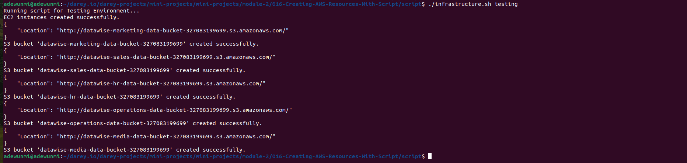
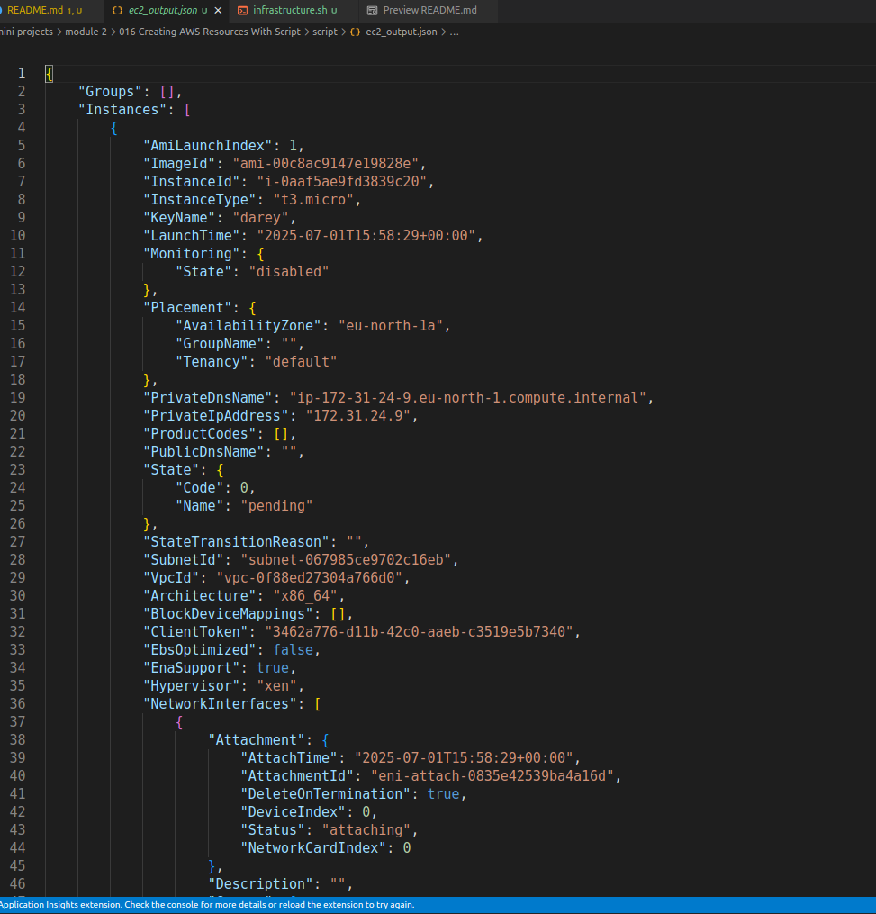
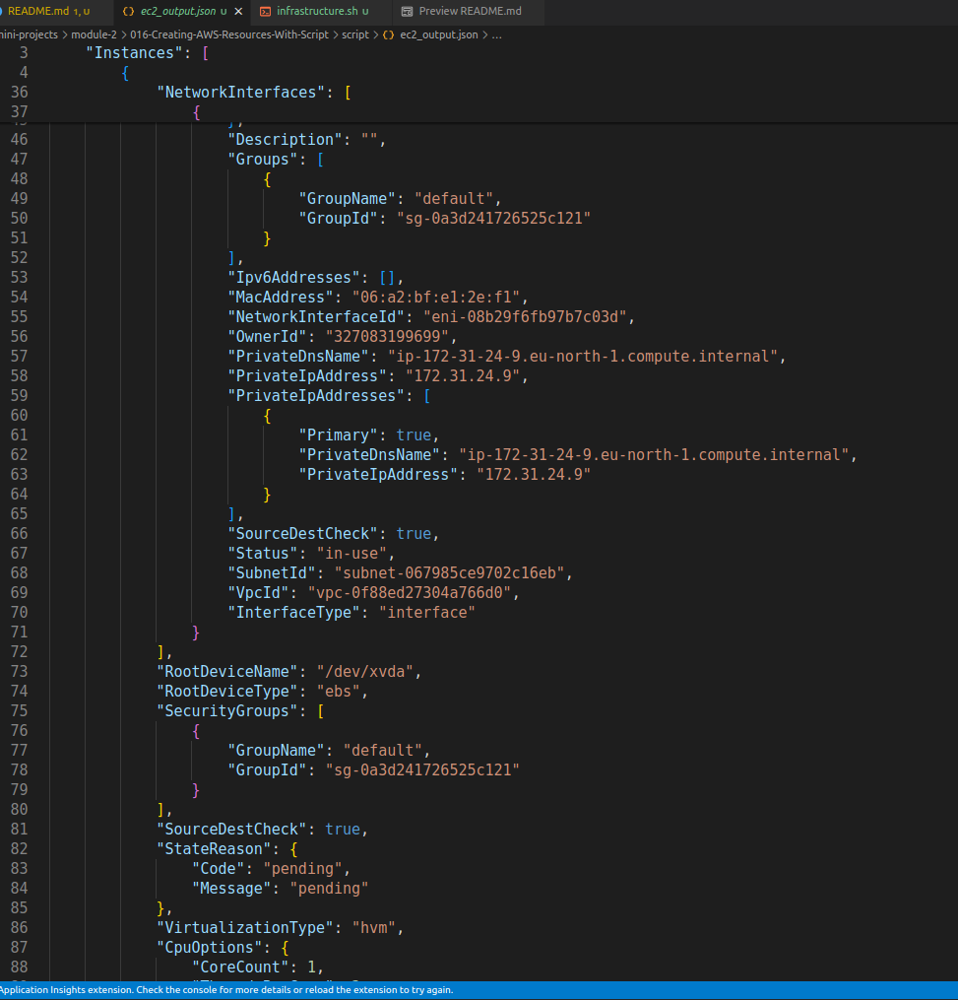
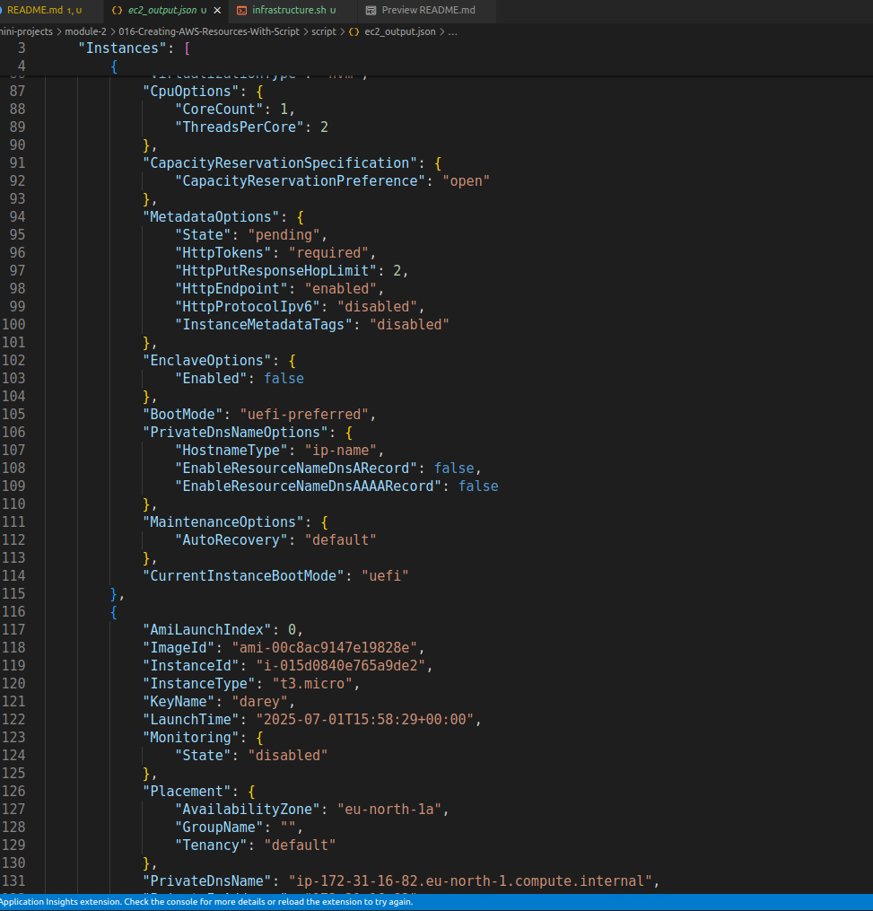
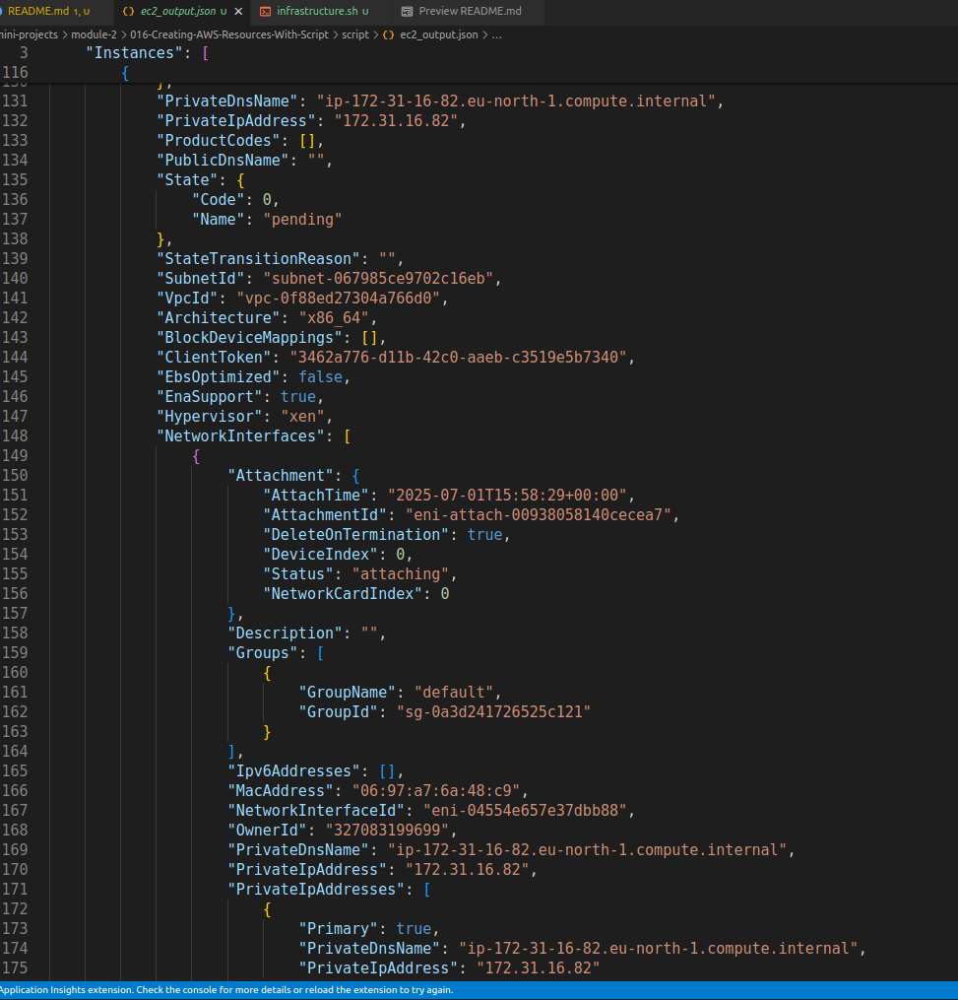
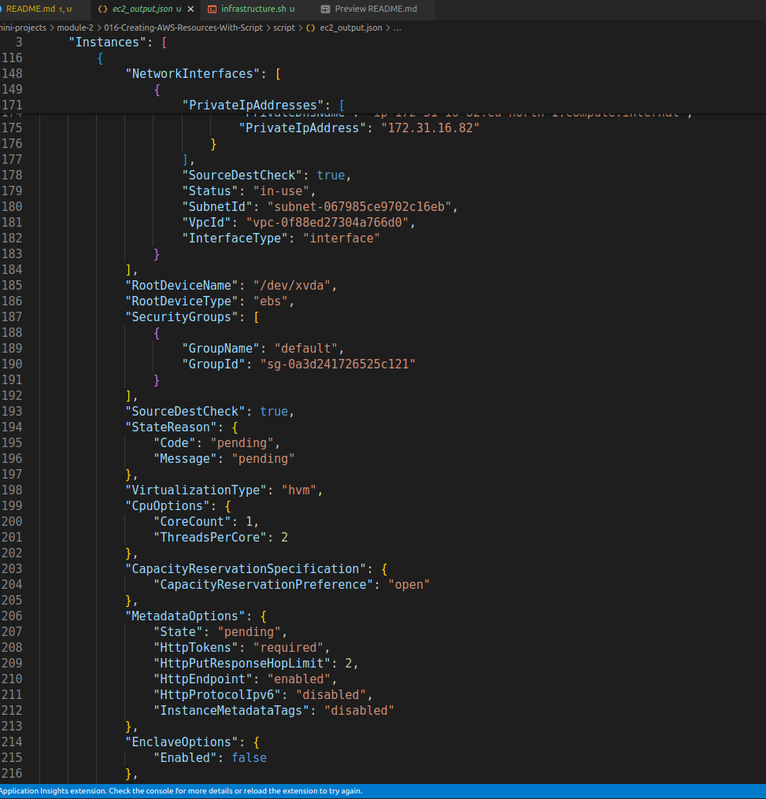
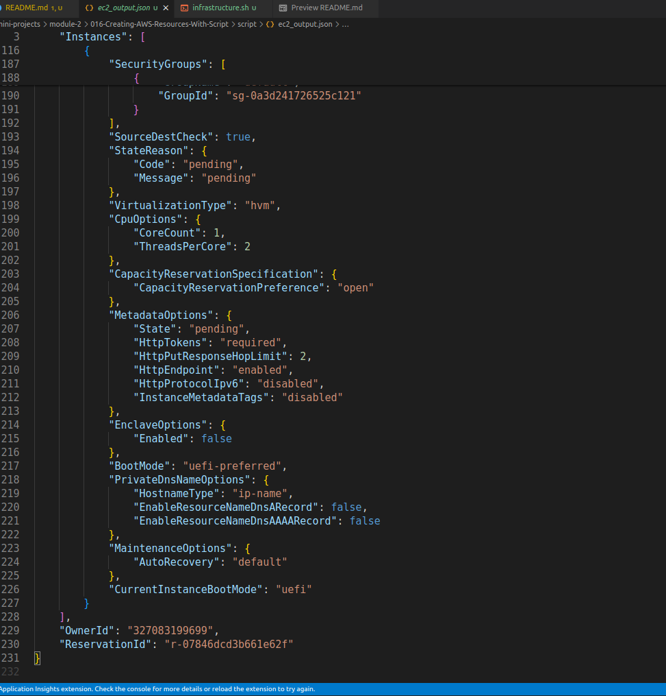

# Creating AWS Resources With Shell Functions And Arrays

This project entails the creation of functions to streamline the process of resource creation and enable tasks automtion effectively. These functions include:

1. One for provisioning ec2 instances and
2. Another for setting up s3 buckets

## Function To Provision EC2 instances

```bash
#!/bin/bash

# Function to create EC2 instances
create_ec2_instances() {
    # Specify the parameters for the EC2 instances
    instance_type="t2.micro"
    ami_id="ami-0cd59ecaf368e5ccf"
    count=2  # Number of instances to create
    region="eu-west-2" # Region to create cloud resources
    key_name="MyKeyPair"

    # Create the EC2 instances
    aws ec2 run-instances \
        --image-id "$ami_id" \
        --instance-type "$instance_type" \
        --count $count \
        --key-name "$key_name" \
        --region "$region"

    # Check if the EC2 instances were created successfully
    if [ $? -eq 0 ]; then
        echo "EC2 instances created successfully."
    else
        echo "Failed to create EC2 instances."
    fi
}

# Call the function to create EC2
create_ec2_instances
```

### Function Explanation

The create_ec2_instances function is a Bash shell function that automates the creation of EC2 instances on AWS. Here’s what it does:

- Defines parameters for the EC2 instances, such as the instance type, AMI ID, number of instances, AWS region, and key pair name.
- Runs the AWS CLI command aws ec2 run-instances with the specified parameters to launch the EC2 instances.
- Checks if the command was successful by evaluating the exit status ($?). If successful, it prints a success message; otherwise, it prints a failure message. </br>

This function helps to quickly and consistently launch EC2 instances with predefined settings, making AWS resource provisioning more efficient and less error-prone.

## Function To Provision S3 Buckets

**Objective:** Create five distinct s3 buckets, each designated for storing data related to Marketing, Sales, HR, Operations and Media. </br>
To achieve this we'll make use of a fundamental data structure in shell scripting known as **array**. This is essential because we need one single variable holding all the data and then have the capability to loop through them.

### Array In Shell Scripting

An **array** in shell scripting is a data structure that allows you to store multiple values in a single variable. Arrays are useful when you need to manage a list of items, such as resource names or IDs, and perform operations on each item using loops.

#### How to Declare an Array

```bash
bucket_names=("marketing-data-bucket" "sales-data-bucket" "hr-data-bucket" "operations-data-bucket" "media-data-bucket")
```

#### How to Access Array Elements

- Access a single element:

 ```bash
  echo "${bucket_names[0]}"  # Outputs: marketing-data-bucket
  ```

- Access all elements:

  ```bash
  echo "${bucket_names[@]}"
  ```

#### How to Loop Through an Array

```bash
for bucket in "${bucket_names[@]}"; do
    echo "Creating bucket: $bucket"
    # aws s3 mb s3://$bucket --region your-region
done
```

**Summary:**  
Arrays make it easy to manage and automate tasks involving multiple resources in your shell scripts, such as creating several S3 buckets in

Below is the function to create s3 buckets:

```bash
# Function to create S3 buckets for different departments
create_s3_buckets() {
    # Define a company name as prefix
    company="datawise"
    # Array of department names
    departments=("Marketing" "Sales" "HR" "Operations" "Media")
    region="your-region"  # Set your AWS region here

    # Loop through the array and create S3 buckets for each department
    for department in "${departments[@]}"; do
        bucket_name="${company}-${department}-Data-Bucket"
        # Create S3 bucket using AWS CLI
        aws s3api create-bucket --bucket "$bucket_name" --region "$region"
        if [ $? -eq 0 ]; then
            echo "S3 bucket '$bucket_name' created successfully."
        else
            echo "Failed to create S3 bucket '$bucket_name'."
        fi
    done
}

# Call the function to create S3 buckets for different
create_s3_buckets
```

#### Breakdown of the `create_s3_buckets` function

Let's break down each part of the S3 bucket creation function code:

---

```bash
# Function to create S3 buckets for different departments
create_s3_buckets() {
```

- **Defines a function** called `create_s3_buckets`. All the logic for creating buckets will be inside this function.

---

```bash
    # Define a company name as prefix
    company="datawise"
```

- **Sets a variable** `company` to `"datawise"`. This will be used as a prefix for all bucket names, ensuring they are unique and identifiable.

---

```bash
    # Array of department names
    departments=("Marketing" "Sales" "HR" "Operations" "Media")
```

- **Declares an array** called `departments` containing the names of the departments. Each department will get its own S3 bucket.

---

```bash
    region="your-region"  # Set your AWS region here
```

- **Sets the AWS region** where the buckets will be created. Replace `"your-region"` with the actual AWS region you want to use (e.g., `eu-west-2`).

---

```bash
    # Loop through the array and create S3 buckets for each department
    for department in "${departments[@]}"; do
```

- **Loops through each department** in the `departments` array. The variable `department` will take each value in turn (e.g., "Marketing", "Sales", etc.).

---

```bash
        bucket_name="${company}-${department}-Data-Bucket"
```

- **Constructs the bucket name** by combining the company name, department name, and a suffix. For example, `"datawise-Marketing-Data-Bucket"`.

---

```bash
        # Create S3 bucket using AWS CLI
        aws s3api create-bucket --bucket "$bucket_name" --region "$region"
```

- **Runs the AWS CLI command** to create an S3 bucket with the constructed name in the specified region.

---

```bash
        if [ $? -eq 0 ]; then
            echo "S3 bucket '$bucket_name' created successfully."
        else
            echo "Failed to create S3 bucket '$bucket_name'."
        fi
```

- **Checks if the previous command succeeded** (`$?` is the exit status of the last command).
  - If successful, prints a success message.
  - If not, prints a failure message.

---

```bash
    done
}
```

- **Ends the loop and the function.** All departments will have their buckets created by the time the loop finishes.

---

```bash
# Call the function to create S3 buckets for different
create_s3_buckets
```

- **Calls the function** so that the bucket creation process actually runs when the script is executed.

---

### **Summary Table**

| Line/Block                                      | Purpose                                                      |
|-------------------------------------------------|--------------------------------------------------------------|
| `create_s3_buckets() { ... }`                   | Defines the function                                         |
| `company="datawise"`                            | Sets a prefix for bucket names                               |
| `departments=(...)`                             | Lists all departments as an array                            |
| `region="your-region"`                          | Sets the AWS region                                          |
| `for department in "${departments[@]}"; do ...` | Loops through each department                                |
| `bucket_name=...`                               | Builds a unique bucket name for each department              |
| `aws s3api create-bucket ...`                   | Creates the S3 bucket using AWS CLI                          |
| `if [ $? -eq 0 ]; then ... fi`                  | Checks if the bucket was created and prints a message        |
| `done`                                          | Ends the loop                                                |
| `}`                                             | Ends the function                                            |
| `create_s3_buckets`                             | Calls the function to execute the bucket creation process    |

---

This structure makes the script modular, easy to maintain, and scalable for adding more departments or changing

### The Final Script

```bash
#!/bin/bash

# Environment variable for environment selection
ENVIRONMENT=$1

# Function to check the number of arguments
check_num_of_args() {
    # Checking the number of arguments
    if [ "$#" -ne 1 ]; then
        echo "Usage: $0 <environment>"
        exit 1
    fi
}

# Function to activate infrastructure environment
activate_infra_environment() {
    # Acting based on the argument value
    if [ "$ENVIRONMENT" == "local" ]; then
        echo "Running script for Local Environment..."
    elif [ "$ENVIRONMENT" == "testing" ]; then
        echo "Running script for Testing Environment..."
    elif [ "$ENVIRONMENT" == "production" ]; then
        echo "Running script for Production Environment..."
    else
        echo "Invalid environment specified. Please use 'local', 'testing', or 'production'."
        exit 2
    fi
}

# Function to check if AWS CLI is installed
check_aws_cli() {
    if ! command -v aws &> /dev/null; then
        echo "AWS CLI is not installed. Please install it before proceeding."
        exit 1
    fi
}

# Function to check if AWS profile is set
check_aws_profile() {
    if [ -z "$AWS_PROFILE" ]; then
        echo "AWS profile environment variable is not set."
        exit 1
    fi
}

# Function to create EC2 Instances
create_ec2_instances() {
    # Specify the parameters for the EC2 instances
    instance_type="t2.micro"
    ami_id="ami-0cd59ecaf368e5ccf"
    count=2  # Number of instances to create
    region="eu-west-2" # Region to create cloud resources
    key_name="MyKeyPair"

    # Create the EC2 instances
    aws ec2 run-instances \
        --image-id "$ami_id" \
        --instance-type "$instance_type" \
        --count $count \
        --key-name "$key_name" \
        --region "$region" > ec2_output.json

    # Check if the EC2 instances were created successfully
    if [ $? -eq 0 ]; then
        echo "EC2 instances created successfully."
    else
        echo "Failed to create EC2 instances."
    fi
}

# Function to create S3 buckets for different departments
create_s3_buckets() {
    # Define a company name as prefix
    company="datawise"
    # Array of department names
    departments=("Marketing" "Sales" "HR" "Operations" "Media")
    region="eu-west-2"  # Set your AWS region here

    # Loop through the array and create S3 buckets for each department
    for department in "${departments[@]}"; do
        bucket_name="${company}-${department}-Data-Bucket"
        # Create S3 bucket using AWS CLI
        aws s3api create-bucket --bucket "$bucket_name" --region "$region"
        if [ $? -eq 0 ]; then
            echo "S3 bucket '$bucket_name' created successfully."
        else
            echo "Failed to create S3 bucket '$bucket_name'."
        fi
    done
}

# Main script execution
check_num_of_args "$@"
activate_infra_environment
check_aws_cli
check_aws_profile
create_ec2_instances
create_s3_buckets
```

### Script Explanation

This script automates the setup of AWS resources (EC2 instances and S3 buckets) using Bash functions, arrays, environment variables, and error handling. Here’s a breakdown of each part:

---

#### 1. Environment Variable for Environment Selection

```bash
ENVIRONMENT=$1
```

- Captures the first command-line argument to determine which environment (local, testing, production) the script should run for.

---

#### 2. Function: check_num_of_args

```bash
check_num_of_args() { ... }
```

- Ensures the script is run with exactly one argument (the environment).
- If not, it prints usage instructions and exits.

---

#### 3. Function: activate_infra_environment

```bash
activate_infra_environment() { ... }
```

- Checks the value of the `ENVIRONMENT` variable.
- Prints which environment is being used or exits with an error if the value is invalid.

---

#### 4. Function: check_aws_cli

```bash
check_aws_cli() { ... }
```

- Verifies that the AWS CLI is installed on the system.
- Exits with an error if not found.

---

#### 5. Function: check_aws_profile

```bash
check_aws_profile() { ... }
```

- Checks if the `AWS_PROFILE` environment variable is set.
- Exits with an error if not set, ensuring AWS credentials are available.

---

#### 6. Function: create_ec2_instances

```bash
create_ec2_instances() { ... }
```

- Sets parameters for EC2 instances (instance type, AMI ID, count, region, key name).
- Uses the AWS CLI to launch EC2 instances with those parameters.
- Checks if the command succeeded and prints a success or failure message.
- The result of the ec2 creation was also redirected to a new file to stream line the process by adding addition flag `> ec2_output.json`

---

#### 7. Function: create_s3_buckets

```bash
create_s3_buckets() { ... }
```

- Defines a company name and an array of department names.
- Loops through each department, constructs a unique bucket name, and creates the S3 bucket in the specified region using the AWS CLI.
- Prints a message indicating success or failure for each bucket.

---

#### 8. Main Script Execution

```bash
check_num_of_args "$@"
activate_infra_environment
check_aws_cli
check_aws_profile
create_ec2_instances
create_s3_buckets
```

- Calls each function in order to:
  1. Validate arguments
  2. Set up the environment
  3. Check prerequisites (AWS CLI and profile)
  4. Create EC2 instances
  5. Create S3 buckets

---

#### **Summary**

- **Modular:** Each task is in its own function for clarity and reuse.
- **Secure:** Uses environment variables and checks for AWS credentials.
- **Flexible:** Accepts environment as a command-line argument.
- **Robust:** Includes error handling after each critical operation.
- **Automated:** Provisions both EC2 instances and S3 buckets with a single script.

This approach ensures the AWS infrastructures can be set up quickly, consistently, and safely.

### Result of The script

- The screen shot below shows the creation of the resources was successful

The screenshpts below show the contents of output file that stores the console result of ec2 creation: 







The full script can be accessed here 

### Key Takeaways

In this project, we have learnt how to automate AWS infrastructure provisioning using shell scripting, which is a valuable DevOps skill. By modularizing the script with functions, the code was organized and reusable for tasks like EC2 and S3 creation. Array was leveraged upon to efficiently manage multiple resources, and also environment variables and command-line arguments were used to make the script flexible and secure. Robust error handling ensured the script could gracefully handle failures and provide clear feedback. Capturing AWS CLI output and integrating checks for prerequisites like the AWS CLI and credentials improved reliability and user experience. Overall, this project demonstrated how shell scripting can streamline cloud resource management, reduce manual effort, and enforce best practices for repeatable, consistent infrastructure deployment.
