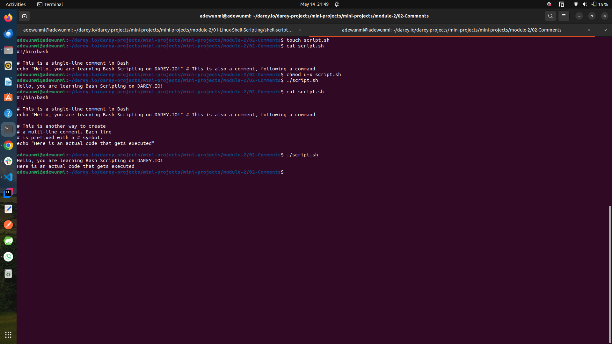

# 💬 Comments in Bash Scripts

Comments in Bash scripts are lines that the shell ignores during execution. They're used to explain code, provide instructions, or temporarily disable commands — helping with readability and maintainability.

---

## ✅ **Single-Line Comments**

Use the `#` symbol:

```bash
#!/bin/bash
# This script prints a greeting
echo "Hello, World!"  # Print greeting to console
```

---

### ⚠️ **Important Notes**

- Comments can be placed **before** a line or **inline** after a command.
- Everything after `#` on a line is considered a comment — **except** inside quotes.

```bash
echo "# This is not a comment, it's a string"
```

---

## Multi-line Comments

🚫 **Bash Does Not Support Multi-Line Comment Syntax (like `/* */`)**

To simulate multi-line comments, prefix each line with `#`:

```bash
# This is a
# multi-line
# comment in bash
```

Alternatively, for block-style documentation, you can use a here-doc trick (for advanced users):

```bash
: <<'END_COMMENT'
This is a block comment.
It won’t be executed.
END_COMMENT
```

> `:` is a built-in no-op (does nothing), and the here-doc syntax (`<<`) treats the block as input.

---

### Handons Experience

- The screenshot shot shows some practice on comments:
  
