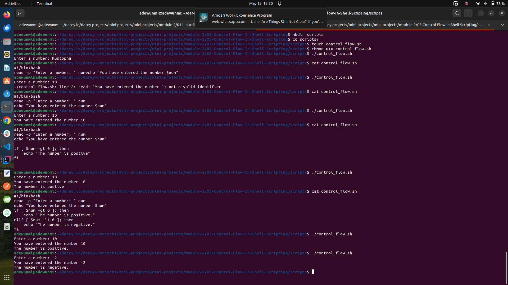
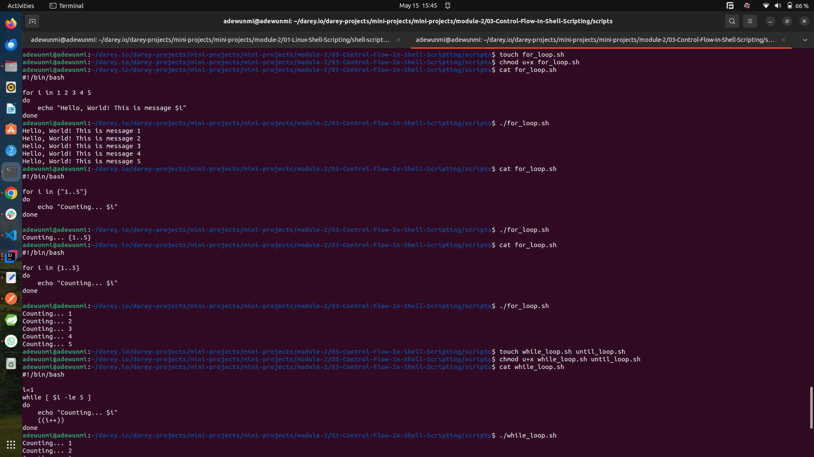
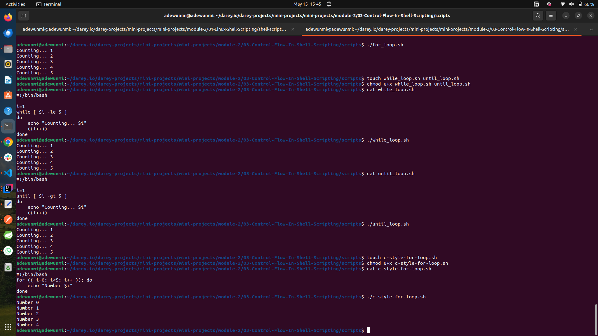

# Control Flow In Shell Scripting

## 🔁 Control Flow in Shell Scripting (Bash)

Control flow structures allow you to make decisions and repeat actions in your Bash scripts, enabling automation and logic handling.

---

## 1️⃣ **Conditional Statements**

### **if / else / elif**

```bash
if [ "$age" -ge 18 ]; then
  echo "You are an adult."
elif [ "$age" -ge 13 ]; then
  echo "You are a teenager."
else
  echo "You are a child."
fi
```

✅ Use `-eq`, `-ne`, `-lt`, `-le`, `-gt`, `-ge` for numbers.
✅ Use `==`, `!=`, `<`, `>` for strings (with `[[ ]]` for string comparisons).

---

## 2️⃣ **Case Statement**

Used for multi-way branching — like a cleaner `if-elif` chain.

```bash
read -p "Enter a number (1-3): " num
case $num in
  1) echo "You chose One." ;;
  2) echo "You chose Two." ;;
  3) echo "You chose Three." ;;
  *) echo "Invalid choice." ;;
esac
```

---

## 3️⃣ **Loops**

### 🔄 **for Loop**

```bash
for i in 1 2 3; do
  echo "Number: $i"
done
```

With C-style syntax:

```bash
for ((i=0; i<5; i++)); do
  echo "i = $i"
done
```

---

### 🔁 **while Loop**

```bash
count=1
while [ $count -le 5 ]; do
  echo "Count: $count"
  ((count++))
done
```

---

### 🔁 **until Loop**

Executes until the condition becomes true:

```bash
count=1
until [ $count -gt 5 ]; do
  echo "Count: $count"
  ((count++))
done
```

---

## 4️⃣ **Loop Control Keywords**

* `break` – Exit the loop
* `continue` – Skip to the next iteration

```bash
for i in {1..5}; do
  if [ $i -eq 3 ]; then
    continue
  fi
  echo "i: $i"
done
```

---

## 🧠 Summary

| Control Flow | Use Case                          |
| ------------ | --------------------------------- |
| `if/else`    | Conditional branching             |
| `case`       | Multi-option checks               |
| `for`        | Iterate over list/range           |
| `while`      | Loop while condition is true      |
| `until`      | Loop until condition becomes true |
| `break`      | Exit a loop early                 |
| `continue`   | Skip current iteration            |

---

## Handson Experience

---
The screenshots below shows some practices on control flow

### User input, if and if-else practice

* 

### Loops

* 

* 
