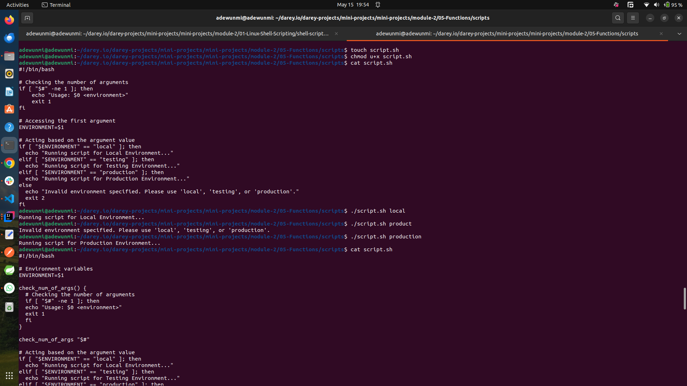
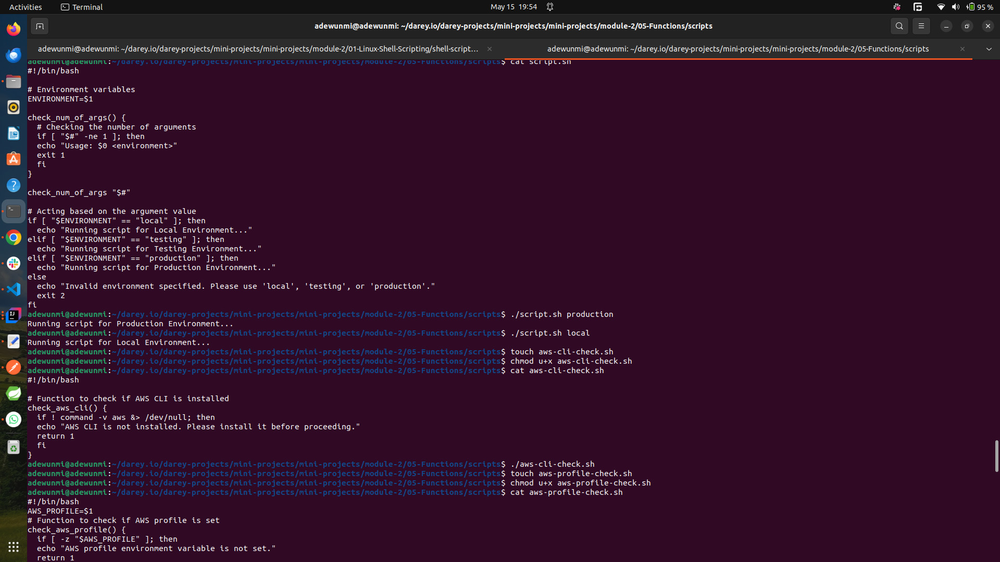
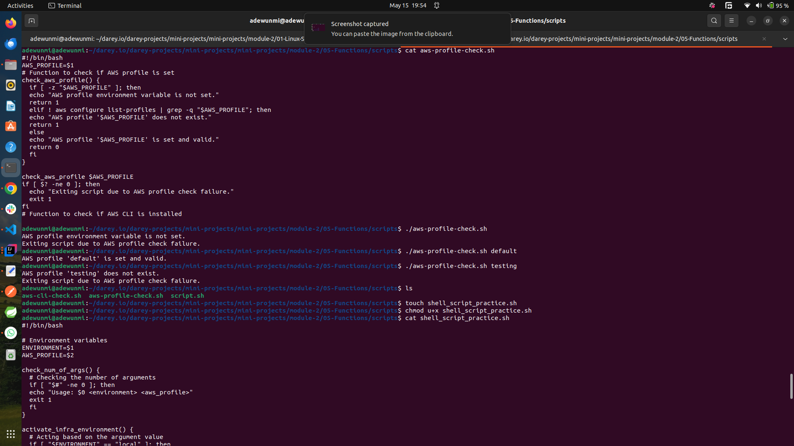
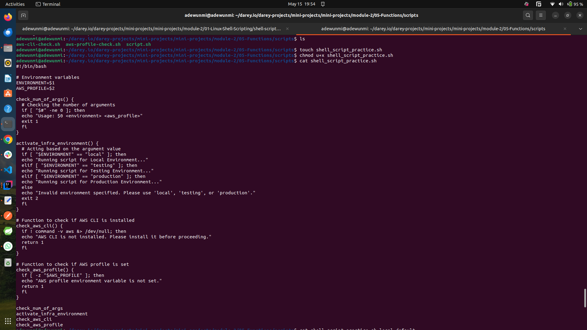
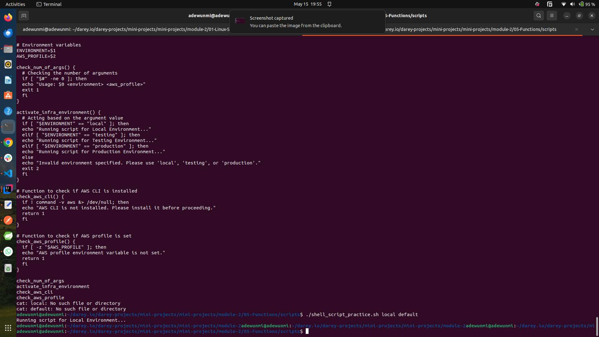

# 🔧 Functions in Shell Scripting (Bash)

Functions in Bash are reusable blocks of code that make scripts more modular, readable, and maintainable.

---

## ✅ 1. **Defining a Function**

```bash
function say_hello {
  echo "Hello, $1!"
}
```

Or simply:

```bash
say_hello() {
  echo "Hello, $1!"
}
```

* `$1`, `$2`, ... represent positional parameters passed to the function.
* `return` can be used to exit a function with a specific status.

---

## ✅ 2. **Calling a Function**

```bash
say_hello "Alice"
```

**Output:**

```console
Hello, Alice!
```

---

## ✅ 3. **Returning Values**

Functions can return **exit status codes**, not strings:

```bash
add() {
  result=$(( $1 + $2 ))
  echo $result  # Print result to stdout
  return 0
}

sum=$(add 3 5)
echo "Sum is $sum"
```

---

## ✅ 4. **Function with Return Code**

```bash
check_file() {
  if [ -f "$1" ]; then
    echo "File exists"
    return 0
  else
    echo "File does not exist"
    return 1
  fi
}

check_file "myfile.txt" || echo "Error: file not found"
```

---

## ✅ 5. **Using Global and Local Variables**

```bash
print_name() {
  local name="Bash"
  echo "Name: $name"
}

print_name
echo "Outside function, name is still unset"
```

* `local` restricts variable scope to the function.

---

## 🧠 Summary

| Feature                     | Description                             |
| --------------------------- | --------------------------------------- |
| `function name` or `name()` | Define a function                       |
| `$1`, `$2`                  | Access function arguments               |
| `return N`                  | Return exit status (0 = success)        |
| `local`                     | Declare function-scoped variables       |
| `$(function)`               | Capture function output into a variable |

---

## Handson Experience

```bash
#!/bin/bash

# Environment variables
ENVIRONMENT=$1
AWS_PROFILE=$2

check_num_of_args() {
  # Checking the number of arguments
  if [ "$#" -ne 0 ]; then
  echo "Usage: $0 <environment> <aws_profile>"
  exit 1
  fi
}

activate_infra_environment() {
  # Acting based on the argument value
  if [ "$ENVIRONMENT" == "local" ]; then
  echo "Running script for Local Environment..."
  elif [ "$ENVIRONMENT" == "testing" ]; then
  echo "Running script for Testing Environment..."
  elif [ "$ENVIRONMENT" == "production" ]; then
  echo "Running script for Production Environment..."
  else
  echo "Invalid environment specified. Please use 'local', 'testing', or 'production'."
  exit 2
  fi
}

# Function to check if AWS CLI is installed
check_aws_cli() {
  if ! command -v aws &> /dev/null; then
  echo "AWS CLI is not installed. Please install it before proceeding."
  return 1
  fi
}

# Function to check if AWS profile is set
check_aws_profile() {
  if [ -z "$AWS_PROFILE" ]; then
  echo "AWS profile environment variable is not set."
  return 1
  fi
}

check_num_of_args
activate_infra_environment
check_aws_cli
check_aws_profile
```

## Details

The above Bash script is used to set up and validate the infrastructure environment for AWS. It ensures that the required environment variables and tools are in place before proceeding.

---

### 1. **Environment Variables**

The script accepts two arguments:

* **`ENVIRONMENT`**: Specifies the environment (e.g., `local`, `testing`, or `production`).

* **`AWS_PROFILE`**: Specifies the AWS profile to use.

---

### 2. **Functions**

#### **`check_num_of_args`**

* Ensures the script is called with exactly two arguments (`<environment>` and `<aws_profile>`).
* If not, it displays usage instructions and exits.

#### **`activate_infra_environment`**

* Acts based on the value of `ENVIRONMENT`:
  * Prints a message for `local`, `testing`, or `production` environments.
  * Exits with an error if an invalid environment is specified.

#### **`check_aws_cli`**

* Checks if the AWS CLI is installed by verifying the `aws` command is available.
* If not installed, it displays an error message and exits.

#### **`check_aws_profile`**

* Checks if the `AWS_PROFILE` environment variable is set.
* If not set, it displays an error message and exits.

---

### 3. **Execution Flow**

The script calls the functions in the following order:

1. **`check_num_of_args`**: Validates the number of arguments.
2. **`activate_infra_environment`**: Processes the environment argument.
3. **`check_aws_cli`**: Ensures AWS CLI is installed.
4. **`check_aws_profile`**: Ensures the AWS profile is set.

---

### 4. **Purpose**

The script is designed to:

* Validate input arguments.
* Ensure the required tools (AWS CLI) and configurations (AWS profile) are in place.
* Perform actions based on the specified environment (`local`, `testing`, or `production`).

---

### 5. **Error Handling**

The script exits with appropriate error messages if:

* Incorrect arguments are provided.
* AWS CLI is not installed.
* AWS profile is not set.
* An invalid environment is specified.

---

The screenshots below shows some result from running shell scripts surrounding functions

* 
* 
* 
* 
* 
