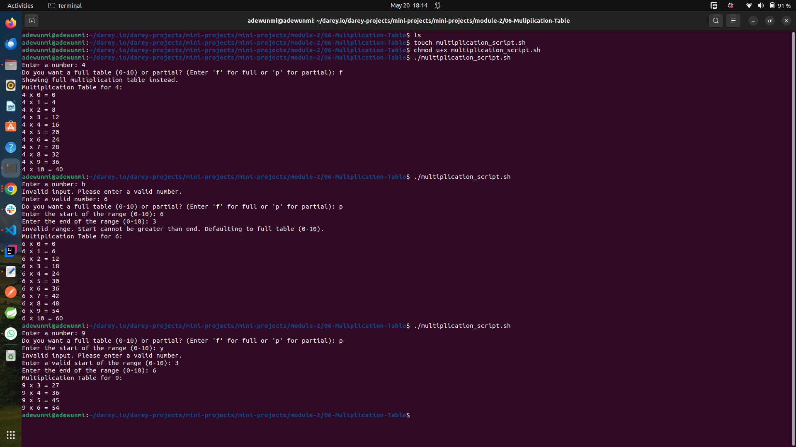

# BASH SCRIPT FOR GENERATING MULTIPLICATION TABLE

## The script

```bash
#!/bin/bash

# Function to check if input is a positive number
is_number() {
  if ! [[ "$1" =~ ^[0-9]+$ ]]; then
    echo "Invalid input. Please enter a valid positive number."
    return 1
  fi
  return 0
}

# Function to check if range is within 0-10
is_in_range() {
  if [ "$1" -lt 0 ] || [ "$1" -gt 10 ]; then
    echo "Range out of bounds. Please enter a number between 0 and 10."
    return 1
  fi
  return 0
}

# Function to validate range
validate_range() {
  is_number "$1" && is_in_range "$1"
  return $?
}

# Prompt user for a number
read -p "Enter a number: " number

# Validate the number (must be a positive number)
is_number "$number"
while [ $? -ne 0 ]; do
  read -p "Enter a valid positive number: " number
  is_number "$number"
done

# Ask user for full or partial table
read -p "Do you want a full table (0-10) or partial? (Enter 'f' for full or 'p' for partial): " choice

# Generate multiplication table
if [ "$choice" == "p" ]; then
  # Prompt user for start and end of the range
  read -p "Enter the start of the range (0-10): " start
  validate_range "$start"
  while [ $? -ne 0 ]; do
    read -p "Enter a valid start of the range (0-10): " start
    validate_range "$start"
  done

  read -p "Enter the end of the range (0-10): " end
  validate_range "$end"
  while [ $? -ne 0 ]; do
    read -p "Enter a valid end of the range (0-10): " end
    validate_range "$end"
  done

  # Ensure start is less than or equal to end
  if [ "$start" -gt "$end" ]; then
    echo "Invalid range. Start cannot be greater than end. Defaulting to full table (0-10)."
    start=0
    end=10
  fi
else
  echo "Showing full multiplication table instead."
  start=0
  end=10
fi

# Print the multiplication table
echo "Multiplication Table for $number:"
for ((i=start; i<=end; i++)); do
  echo "$number x $i = $((number * i))"
done
```

---

## Terminal result when the script was ran



---

## How It works

### Input Validation

- Ensures the user enters a valid number and valid range (between 1 and 10.)
- Provides feedback for invalid inputs and prompts the user again.

### Full or Partial Table

If the user selects "partial," they are prompted to enter a range (e.g., 1-5).
Validates the range and defaults to a full table if the range is invalid.

### Multiplication Table

Generates the multiplication table based on the user's choice (full or partial).
