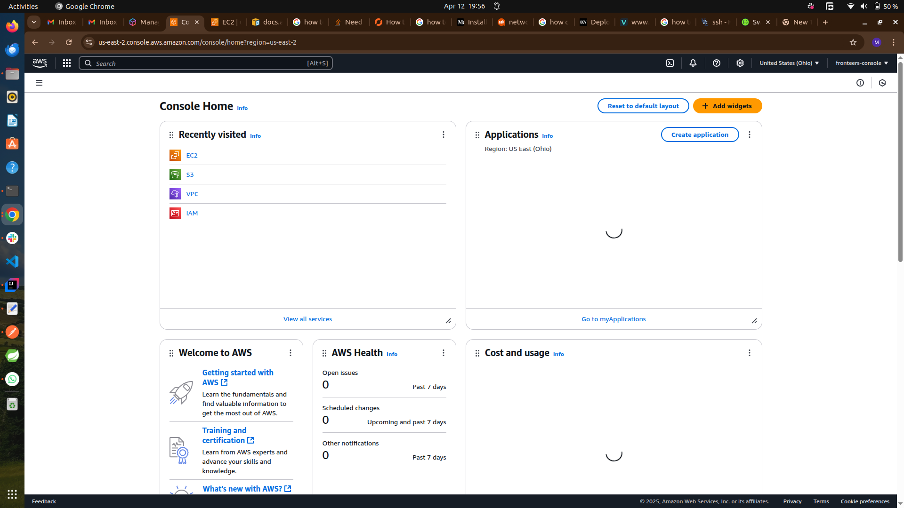

# AWS Management Console

## What is the Cloud?

The **cloud** refers to servers that are accessed over the Internet, and the software and databases that run on those servers. Instead of owning and maintaining physical servers or storage devices, individuals and organizations can use computing resources provided by third-party companies (like AWS, Microsoft Azure, or Google Cloud) on-demand.

## What is Cloud Computing?

**Cloud computing** is the delivery of computing services—including servers, storage, databases, networking, software, analytics, and intelligence—over the Internet (“the cloud”) to offer faster innovation, flexible resources, and economies of scale. You typically pay only for the cloud services you use, helping you lower operating costs, run your infrastructure more efficiently, and scale as your business needs change.

### Key Characteristics

- **On-demand self-service:** Users can provision computing resources as needed automatically, without requiring human interaction with each service provider.
- **Broad network access:** Services are available over the network and accessed through standard mechanisms (e.g., web browsers).
- **Resource pooling:** Providers serve multiple customers with scalable resources that are dynamically assigned and reassigned according to demand.
- **Rapid elasticity:** Resources can be scaled up or down quickly to meet demand.
- **Measured service:** Resource usage is monitored, controlled, and reported, providing transparency for both the provider and consumer.

### Types of Cloud Computing

- **Public Cloud:** Services are delivered over the public internet and shared across organizations.
- **Private Cloud:** Services are maintained on a private network, offering greater control and security.
- **Hybrid Cloud:** Combines public and private clouds, allowing data and applications to be shared between them.

### Cloud Service Models

- **Infrastructure as a Service (IaaS):** Provides virtualized computing resources over the internet (e.g., Amazon EC2, Microsoft Azure VMs).
- **Platform as a Service (PaaS):** Offers hardware and software tools over the internet, typically for application development (e.g., Google App Engine, AWS Elastic Beanstalk).
- **Software as a Service (SaaS):** Delivers software applications over the internet, on a subscription basis (e.g., Gmail, Microsoft Office 365).

### Benefits of Cloud Computing

- **Cost Efficiency:** No need to invest in hardware or software; pay only for what you use.
- **Scalability:** Easily scale resources up or down as needed.
- **Performance:** Access to high-performance computing resources and global infrastructure.
- **Security:** Advanced security features and compliance certifications.
- **Accessibility:** Access services and data from anywhere with an internet connection.

Cloud computing has transformed the way organizations operate, enabling greater flexibility, efficiency, and innovation.

The screenshot below shows the dashboard of my aws management console

