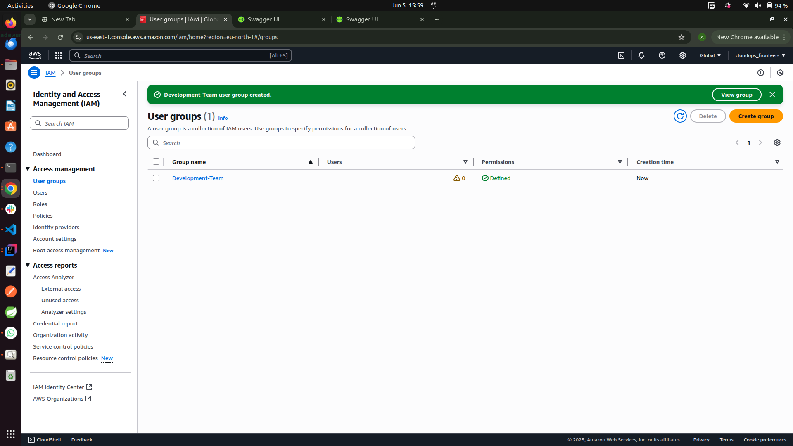
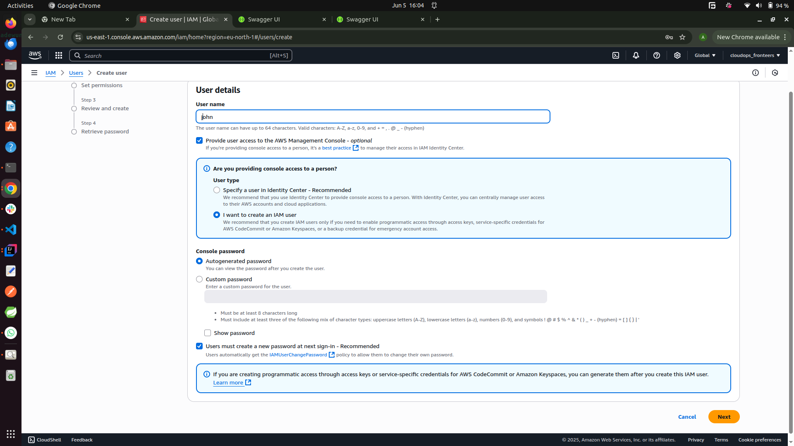

# AWS IAM

## What is AWS IAM?

**AWS Identity and Access Management (IAM)** is a web service that helps you securely control access to AWS resources. With IAM, you can centrally manage users, groups, roles, and permissions in your AWS account.

## Key Features

- **User Management:** Create and manage AWS users and groups, and use permissions to allow and deny their access to AWS resources.
- **Granular Permissions:** Assign fine-grained permissions to users, groups, and roles using IAM policies.
- **Roles:** Define roles and assign them to AWS services or users, enabling temporary access to resources.
- **Multi-Factor Authentication (MFA):** Add an extra layer of security by requiring users to provide a second form of authentication.
- **Federation:** Allow users from outside AWS (such as corporate directories or web identities) to access AWS resources securely.

## Common IAM Concepts

- **User:** An individual identity with long-term credentials to interact with AWS services.
- **Group:** A collection of users with the same permissions.
- **Role:** An AWS identity with specific permissions, assumed by users or services.
- **Policy:** A document that defines permissions and is attached to users, groups, or roles.

## Best Practices

- Follow the principle of least privilege: grant only the permissions required to perform a task.
- Enable MFA for all users.
- Use roles for applications and services that need to access AWS resources.
- Regularly review and audit IAM permissions.

AWS IAM is a foundational service for securing your AWS environment and managing access to your resources.

## Execises

### Use Case

In an organisation (Zappy E-bank) there is need to set up IAM user fork John who is a backend developer to give him access to servers (EC2) to run his code and another IAM user for Mary who is a data abnalyst so as to give her access to data storage (AWS S3 Services).  

Considering Zappy E-bank need to expkand its team with 10 new developers and 15 new data analysts, its inefficient to create similar policies individually for each new staff members. A more streamlined approach involves:

- Setting up a single policy tailored to individuals specific access requirements.
- Associating the policy with a group specifically designed for that role.
- Adding all enginners or analysts to their respective groups, simplifying the management of permissions and ensuring consostent access accross the team.

### Create A policy For the developer team

The screenshots belows shows the creation of the developer policy with all ec2 actions

Using the same approach as above, the data analyst policy was created granting all s3 actions

### Creating Group For The Developer And Data Analyst Policies

### Creating IAM User For John

Recalling that John is a backend developer, therefore he needs to be added to the Developer-Team group.

### Creating IAM User For Mary

Repeating the same step for Mary who needs to be added to the Analyst-Team beacuse she is a Data Analyst.

## Validation

### Using John's account to create an EC2 instance

## MFA (Multi-Factor Authentication)

**Multi-Factor Authentication (MFA)** is an extra layer of security for your AWS account. With MFA enabled, users must provide not only their password (something they know) but also a code from an MFA device (something they have) when signing in.

### Why Use MFA?

- **Enhanced Security:** Even if a password is compromised, an attacker cannot access the account without the MFA code.
- **Compliance:** MFA helps meet security best practices and compliance requirements.
- **Protection for Sensitive Actions:** MFA can be required for specific AWS actions, such as deleting resources or changing permissions.

### Types of MFA Devices Supported by AWS

- **Virtual MFA Devices:** Apps like Google Authenticator or Authy on smartphones.
- **U2F Security Keys:** Physical devices such as YubiKey.
- **Hardware MFA Devices:** Dedicated hardware tokens from AWS.

### How to Enable MFA for an IAM User

1. **Sign in to the AWS Management Console** as an IAM user or root user.
2. Navigate to **IAM > Users**, then select the user.
3. Go to the **Security credentials** tab.
4. Click **Assign MFA device**.
5. Choose the type of MFA device (virtual, U2F, or hardware).
6. Follow the prompts to configure and activate the device.

### MFA Best Practices

- Enable MFA for all IAM users, especially those with administrative privileges.
- Require MFA for sensitive operations using IAM policies.
- Regularly review and rotate MFA devices.

Enabling MFA is a simple but powerful way to significantly improve the security of your AWS environment.

## Setting Up MFA For John

